# tutorials4j

> Java 教程工程：基于 Spring Boot 3 / Spring Cloud 的自研业务框架与配套可运行示例，**代码 + 文档 + 博客**一站式学习。

`tutorials4j`（Java 教程）是一个面向 **Java 21** 的多模块教学与实战工程：既有可复用、可扩展的框架代码（缓存、数据、多租户、验证码、加解密、调度、消息、认证授权、对象存储等能力域），也有 12 个**开箱即用的示例工程**与 3 个**微服务演示服务**；每个组件都在 `docs/blog` 配有源码级技术文章、在 `docs/images` 配有演示截图，适合作为 Spring Boot 业务框架的设计参考与脚手架。

工程整体划分为三部分：

| 一级模块 | 说明 |
|---|---|
| `framework` | 基于 Spring Boot 3 的自研框架：12 个功能域（通用/Web/缓存/数据/多租户/验证码/加解密/调度/消息/认证授权/对象存储/功能），每个功能域均提供核心库 + `spring-boot-starter`；另含 12 个可独立运行的示例工程 |
| `springcloud` | Spring Cloud 微服务演示：授权服务器（Spring Authorization Server）、网关服务器（Gateway + Nacos/Sentinel）、资源服务器（OAuth2 Resource Server） |
| `assembly` | 集成模块（当前为预留空壳聚合工程）：面向"把 framework 组装成可直接运行的业务应用" |

## 项目简介（特性）

- **组件化、可插拔**：缓存、数据、租户、验证码、加解密、任务调度、消息队列、认证授权、对象存储等能力按功能域拆分，可按需独立引入；
- **自动装配、开箱即用**：每个功能域提供 `*-spring-boot-starter`，通过 `@AutoConfiguration` + `@ConditionalOnMissingBean` 实现"依赖即启用、配置即可用、默认可覆盖"；
- **配置驱动**：统一使用 `tutorials4j.*` 配置前缀，属性类内置默认值（默认值即文档）；
- **示例落地**：`framework/framework-examples` 下 12 个示例工程，一条 `spring-boot:run` 命令即可体验各功能域的演示页面；
- **微服务演示**：授权服务器 → 网关 → 资源服务器的完整 JWT 链路，以及网关动态路由 / 流量染色（灰度）/ Sentinel 流控（Nacos 配置中心）等生产级玩法；
- **文档与博客配套**：`docs/blog` 提供 80+ 篇源码级技术文章，与各模块一一对应，边读代码边看文章。

## 技术栈

| 类别 | 技术（版本以根 `pom.xml` 为准） |
|---|---|
| 语言 / 构建 | Java 21、Maven 3.9+（仓库内置 `mvnw` wrapper，Maven 3.9.16） |
| 基础框架 | Spring Boot 3.5.16、Spring Cloud 2025.0.3、Spring Cloud Alibaba 2025.0.0.0 |
| 认证授权 | Sa-Token 1.46.0、Spring Authorization Server、OAuth2 Resource Server |
| 数据访问 | Spring Data JPA / Hibernate、MyBatis-Plus 3.5.15、Druid 1.2.28、p6spy |
| 缓存与锁 | Caffeine、Spring Data Redis、Redisson 4.2.0（本地/Redis/分布式锁、多级缓存） |
| 消息队列 | Kafka、RabbitMQ、NATS、MQTT、WebSocket、Redis（List / ZSet / Stream） |
| 任务调度 | XXL-JOB 3.4.2、PowerJob 5.1.2、自研任务框架（动态任务/防重/事件日志） |
| 微服务 | Spring Cloud Gateway、Nacos（注册/配置）、Sentinel |
| 其它 | Hutool 5.8.38、springdoc-openapi 2.8.17、x-file-storage 2.3.0、Tianai 验证码、UID 生成器等 |

## 目录结构

```
tutorials4j
├── framework                        # 基于 Spring Boot 3 的框架（聚合工程）
│   ├── framework-common             # 通用：错误码/异常体系、全局异常、UID 生成器
│   ├── framework-web                # Web：请求日志/XSS/签名/幂等/TOTP/校验/Trace
│   ├── framework-cache              # 缓存：Caffeine/Redis/Redisson/多级缓存/锁
│   ├── framework-data               # 数据：JPA/Hibernate/MyBatis-Plus/JDBC
│   ├── framework-tenant             # 多租户：表/库隔离、上下文传递、缓存隔离
│   ├── framework-captcha            # 验证码：Hutool/Tianai/统一接口/认证拦截器
│   ├── framework-crypto             # 加解密：算法封装、请求/响应加解密
│   ├── framework-schedule           # 调度：自研任务框架/XXL-JOB/PowerJob
│   ├── framework-message            # 消息：Kafka/RabbitMQ/NATS/MQTT/WebSocket
│   ├── framework-oauth              # 认证授权：API Key 限流、Sa-Token 集成
│   ├── framework-oss                # 对象存储：x-file-storage 封装与监控
│   ├── framework-feature            # 功能：签到/任务/文件管理等功能组装
│   └── framework-examples           # 12 个可运行示例工程（examples-*）
├── springcloud                      # Spring Cloud 微服务演示
│   ├── springcloud-oauth-server     # 授权服务器（Spring Authorization Server）
│   ├── springcloud-gateway-server   # 网关（路由/灰度染色/Sentinel 流控）
│   └── springcloud-resource-server  # 资源服务器（JWT 校验/权限转换）
├── assembly                         # 集成模块（预留空壳）
├── docs                             # 文档：blog（技术文章）/ images（演示截图）
├── config/githooks                  # git 钩子（pre-commit / pre-push）
├── FAQ.md                           # 常见问题
└── LICENSE                          # MIT License
```

## 项目列表

### 顶层模块

| 模块 | 目录 | 子模块数 | 作用 |
|---|---|---|---|
| `framework` | `framework/` | 12 个功能域 + 12 个示例工程 | 自研 Spring Boot 框架：核心库 + Starter + 可运行示例 |
| `springcloud` | `springcloud/` | 3 个服务 | 微服务演示：授权 / 网关 / 资源服务器 |
| `assembly` | `assembly/` | 0（预留） | 集成模块：把 framework 组装成可直接运行的业务应用 |

### framework 功能域

> 每个功能域目录下的结构基本一致：若干核心 jar 子模块 + 一个 `xxx-spring-boot-starter` 启动器子模块。

| 功能域 | 子模块组成 | 核心能力 |
|---|---|---|
| `framework-common` 通用 | Core / Spring / Uid + Starter | 错误码与统一异常体系、常量与配置前缀、Header/Trace 工具、全局异常处理与统一 Result 响应、UID 生成器 |
| `framework-web` Web | Core / Flux / Logging / Rest / Security / Validation + Starter | 请求日志、XSS 防护、API 签名校验、幂等与访问限流、TOTP 二次认证、参数校验、请求体缓存、Trace、WebFlux 适配 |
| `framework-cache` 缓存 | Caffeine / Core / Redis / Redisson / Multi-Level + Starter | 命名缓存与两级缓存、Caffeine/Redis 缓存管理器、本地/Redis/Redisson 锁、Bitmap 统计、计数缓存模板、Redis Lua 原子操作、幂等守卫 |
| `framework-data` 数据 | Core / Jdbc / Hibernate / MyBatis-Plus + Starter | JPA 基础实体与审计、MyBatis-Plus 拦截器扩展、雪花主键生成器、BaseEnum 枚举处理、Hibernate 二级缓存适配、SQL 日志（p6spy） |
| `framework-tenant` 多租户 | Core / Cache / Hibernate / MyBatis-Plus + Starter | 基于 TTL 的租户上下文传递、数据库/表隔离、缓存 Key 前缀与多租户缓存隔离 |
| `framework-captcha` 验证码 | Core / Hutool / Tianai / Web + Starter | Hutool / Tianai 验证码、统一验证码接口、验证码认证拦截器 |
| `framework-crypto` 加解密 | Core / Hutool / Web + Starter | 常见加解密算法封装与密钥管理、请求体自动加解密、AES+RSA 混合加密 |
| `framework-schedule` 调度 | Core / Spring / Redis / Redisson / Xxl Job / PowerJob + Starter | 自研动态任务框架（生命周期/防重/日志）、XXL-JOB / PowerJob 自动配置集成 |
| `framework-message` 消息 | Core / Kafka / Rabbit / Nats / Mqtt / Websocket + Starter | 多中间件消息封装、Spring Cloud Stream 适配、MQTT、WebSocket |
| `framework-oauth` 认证授权 | Core / So-Token + Starter | API Key 声明式双窗口限流（分钟 + 天）、Sa-Token API Key 模板工厂 |
| `framework-oss` 对象存储 | Core / Spring File Storage + Starter | x-file-storage 统一封装、文件元数据持久化、上传/下载/查询端点、Micrometer 监控指标 |
| `framework-feature` 功能 | Core / Sign In / Schedule / OSS + Starter | 基于 Redis Bitmap 的签到、任务管理、文件管理等功能模块组装 |

### 示例工程（framework/framework-examples/examples-*）

> 每个示例都是一个独立的 Spring Boot 应用（`ExampleXxxApplication`），在模块内 `application.yml` 顶部切换 `spring.profiles.active` 即可体验不同演示，演示界面见下文「框架示例图」。

| 示例模块 | 默认 Profile | 演示内容 |
|---|---|---|
| `examples-common` | `uid` | 统一异常处理、异步任务执行、UID 生成器 |
| `examples-cache` | `lock` | 缓存注解、两级缓存、分布式锁、幂等性、计数缓存等 |
| `examples-data` | `hibernate-secondlevelcache` | JPA / MyBatis-Plus 增删改查、多数据源、Hibernate 二级缓存 |
| `examples-web` | `validation` | 接口防护、请求日志、签名、XSS、参数校验、TOTP、Trace、HTTP 客户端 |
| `examples-tenant` | `mybatis-database` | 多租户用户管理（表隔离 / 数据库隔离 / 缓存隔离） |
| `examples-captcha` | `interceptor` | Hutool / Tianai 验证码、统一接口、过滤器校验 |
| `examples-crypto` | `api` | 加解密工具、API 请求/响应加解密、混合加密 |
| `examples-feature` | `oss` | 签到、任务管理、文件上传（功能模块组装） |
| `examples-schedule` | `schedule` | 动态任务、任务日志、XXL-JOB / PowerJob、Redis/Redisson 防重 |
| `examples-message` | `nats` | Kafka / RabbitMQ / NATS 消息、短信发送 |
| `examples-oss` | `fss` | 基于 x-file-storage 的文件上传 / 下载 / 查询、监控 |
| `examples-oauth` | `apikey` | API Key 限流（分钟 5 次 / 天 10 次演示） |

### Spring Cloud 服务（springcloud/）

| 服务 | 目录 | 核心能力 |
|---|---|---|
| 授权服务器 | `springcloud/springcloud-oauth-server` | Spring Authorization Server 配置、客户端管理、JWK 管理、刷新令牌防护、Token 黑名单、登录审计 |
| 网关服务器 | `springcloud/springcloud-gateway-server` | 动态路由（Nacos 配置中心热更新）、流量染色（灰度发布）、访问日志与 Trace、Sentinel 流控、JWT 校验与中继 |
| 资源服务器 | `springcloud/springcloud-resource-server` | OAuth2 Resource Server、JWT 校验、自定义权限转换、订单示例接口 |

## 环境要求

| 依赖 | 版本 | 说明 |
|---|---|---|
| JDK | 21+ | `pom.xml` 中 `java.version = 21` |
| Maven | 3.9+ | 推荐直接使用仓库自带的 `./mvnw`（wrapper 版本 3.9.16，首次运行自动下载） |
| Git | - | 构建时会通过 git-build-hook 自动安装 `config/githooks` 下的钩子 |
| 中间件 | 按需 | Redis / MySQL / MQ / Nacos 等，各示例的 `application-<profile>.yml` 中有连接配置与注释，按演示所需启动即可 |

## 快速开始：编译、打包、运行

### 1. 获取源码

```bash
git clone https://gitee.com/yunjiao-source/tutorials4j.git   # 主仓库（Gitee）
# 镜像仓库
git clone https://github.com/yunjiao-source/tutorials4j.git
git clone https://gitcode.com/yun-jiao/tutorials4j.git
```

> Windows 下将下文命令中的 `./mvnw` 替换为 `.\mvnw.cmd` 即可。

### 2. 编译

```bash
# 全量编译 + 测试 + 打包 + 安装到本地 Maven 仓库（首次耗时较长，需联网下载依赖）
./mvnw clean install

# 跳过测试，快速全量构建
./mvnw clean install -DskipTests

# 只构建某个模块及其上游依赖（-am = also make），例如仅构建 examples-oauth
./mvnw -pl framework/framework-examples/examples-oauth -am clean install -DskipTests
```

构建注意事项：

- 版本号由根 `pom.xml` 的 `${revision}` 属性统一管理（当前 `3.5.16`），`flatten-maven-plugin` 会在构建时将其展开到各子模块；
- 代码风格使用 **Google Java Format**：`spotless:check` 绑定在 `compile` 阶段，若提交的代码格式不合规会导致构建失败，请先执行：

```bash
./mvnw spotless:apply   # 自动格式化 Java 源码与 pom.xml
./mvnw spotless:check   # 校验是否合规
```

- 若在 IntelliJ IDEA 中使用，直接以根 `pom.xml` 导入多模块工程即可，本地编译安装一次后所有示例均可直接运行。

### 3. 打包

```bash
# 仅打包不安装（含跳过测试）
./mvnw clean package -DskipTests
```

构建产物说明：

| 产物类型 | 说明 |
|---|---|
| framework 各功能域 jar | 普通库 jar（供其它模块依赖），同时会生成 `*-sources.jar` 源码包 |
| examples-* 示例 jar | 由 `spring-boot-maven-plugin` 重打包为**可执行 fat jar** |
| springcloud 三个服务 jar | 同样为可执行 fat jar |

例如：

```
framework/framework-examples/examples-oauth/target/examples-oauth-3.5.16.jar
springcloud/springcloud-oauth-server/target/springcloud-oauth-server-3.5.16.jar
```

### 4. 运行框架示例

**方式一：Maven 直接运行**（推荐，自动使用当前模块默认 profile）：

```bash
./mvnw -pl framework/framework-examples/examples-oauth -am spring-boot:run
```

**方式二：指定 profile 运行**（先查看模块内 `application.yml` 顶部的注释了解可选 profile，再选择 `application-<profile>.yml` 对应的 profile）：

```bash
./mvnw -pl framework/framework-examples/examples-oauth -am spring-boot:run \
  -Dspring-boot.run.profiles=apikey
```

**方式三：打包后直接运行**：

```bash
java -jar framework/framework-examples/examples-oauth/target/examples-oauth-3.5.16.jar \
  --spring.profiles.active=apikey
```

**方式四：IDE 运行**：直接运行对应模块的启动类（如 `ExampleOAuthApplication`），需要切换演示时在 Program arguments 中追加 `--spring.profiles.active=xxx`。

运行提示：

- 示例默认端口为 **8080**；同时运行多个示例时用 `--server.port=8081` 等参数区分；
- 示例常用中间件默认连接约定：Redis `localhost:6379` database 2、MySQL `localhost:3306`（库 `demo`，账号 `root/root`，表结构由 `ddl-auto` 自动维护）；消息类 / 调度类 profile 需要对应的 MQ、XXL-JOB-Admin、PowerJob-Server 等，详见各 `application-<profile>.yml`；
- 若未执行过全量构建，请先在根目录执行一次 `./mvnw clean install -DskipTests`，或保留命令中的 `-am` 让 reactor 自动构建上游依赖。

各示例可切换的 profile（与 `application-*.yml` 一一对应）速查：

| 示例模块 | 默认 profile | 其它 profile | 典型中间件 |
|---|---|---|---|
| examples-common | uid | task | 无 |
| examples-cache | lock | cacheable / template / multi-level | Redis |
| examples-data | hibernate-secondlevelcache | p6spy / mybatis / jpa | MySQL（二级缓存 profile 另需 Redis） |
| examples-web | validation | request-logging / xss / annotation / signature / swagger / cached-body / trace / client / totp | Redis（多数 profile） |
| examples-tenant | mybatis-database | mybatis-table / jpa-table / jpa-database / cache | MySQL + Redis |
| examples-captcha | interceptor | tianai / unified | Redis |
| examples-crypto | api | - | 无 |
| examples-feature | oss | signin / schedule | MySQL + Redis（文件上传 profile 视存储平台） |
| examples-schedule | schedule | redis / redisson / powerjobworker / xxl-job | Redis（/ XXL-JOB-Admin / PowerJob-Server） |
| examples-message | nats | rabbit / kafka | 对应的消息中间件 |
| examples-oss | fss | - | 对象存储平台（配置见 application-fss.yml） |
| examples-oauth | apikey | - | Redis |

### 5. 运行 Spring Cloud 微服务示例

| 服务 | 默认端口 | 关键依赖 | 说明 |
|---|---|---|---|
| springcloud-oauth-server | 9111 | MySQL（需先建库 `springcloud`，表结构 ddl-auto 维护）、Redis（database 4） | 授权服务器，默认 profile：simple |
| springcloud-resource-server | 9110 | 授权服务器（通过 `jwk-set-uri` / `issuer-uri` 对接，配置见 application.yml） | 资源服务器，默认 profile：simple |
| springcloud-gateway-server | 9110 | simple 模式对接本地授权服务器；demo1 模式需要 Nacos（localhost:8848）与 Sentinel | 网关，默认 profile：demo1 |

```bash
# 授权服务器
./mvnw -pl springcloud/springcloud-oauth-server -am spring-boot:run

# 资源服务器（需授权服务器已启动）
./mvnw -pl springcloud/springcloud-resource-server -am spring-boot:run

# 网关（simple：对接本地 oauth-server；demo1：动态路由/灰度/流控，需 Nacos + Sentinel）
./mvnw -pl springcloud/springcloud-gateway-server -am spring-boot:run \
  -Dspring-boot.run.profiles=simple
```

> 提示：各服务的端口、数据源与对接地址请以其自身 `application*.yml` 为准；网关与资源服务器默认端口均为 9110，同机同时演示时请通过 `--server.port` 错开或使用 Nacos 下发的配置。网关 demo1 模式的动态路由与灰度玩法说明见 `springcloud-gateway-server` 中 demo1 包下的 `README.md`。

## 公众号

如果对我的项目代码感兴趣，请关注我的公众号，有很多文章等着你


## 框架示例图

### 通用模块示例（framework/framework-examples/examples-common）

#### profile:exception

> 统一异常处理


> 异步任务执行


> UID 生成器


### 功能模块示例（framework/framework-examples/examples-feature）

#### ✨ Sa-Token集成功能 （profile:sa-token）

> 登录示例
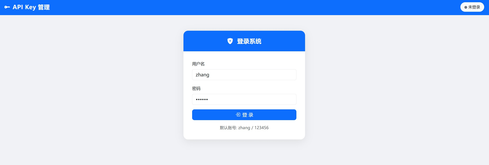

> API Key 用户CURD示例
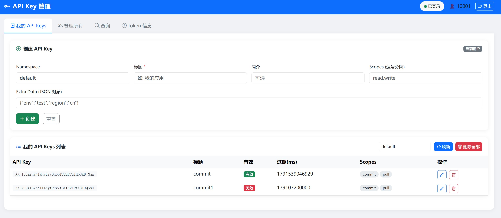

> API Key 管理CURD示例
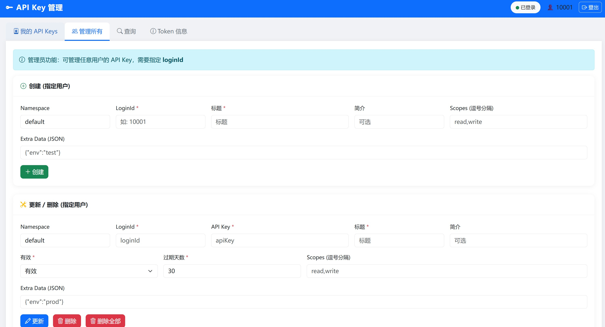

> API Key 查询示例
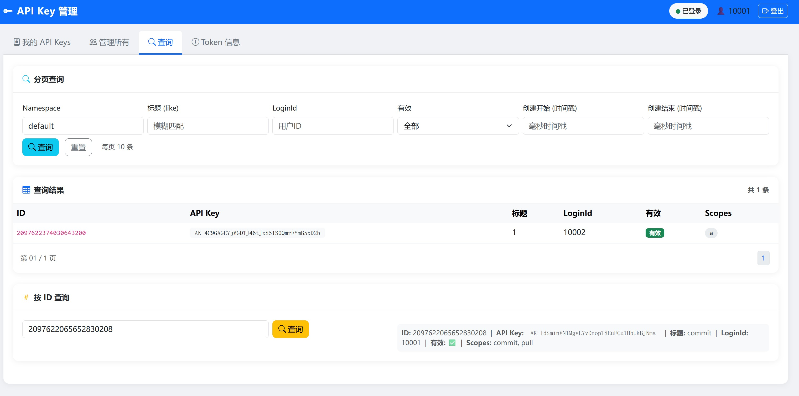

> 获取TokenInfo示例
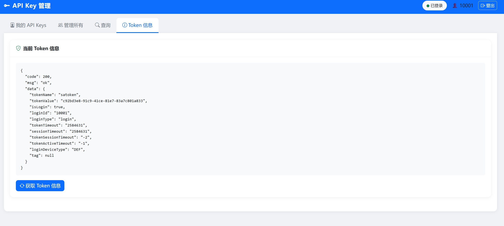
> 
#### 签到功能 （profile:signin）

> 签到示例


> 签到记录查询示例


#### 任务管理 （profile:schedule）

> 任务调度管理


> 任务管理


> 任务日志


> prometheus监控日志


#### ✨ 对象存储oss（profile:oss）

> 文件上传
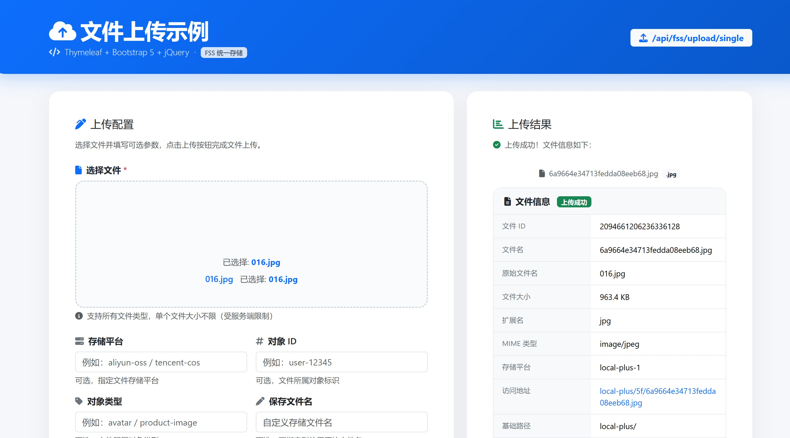

> 上传文件列表
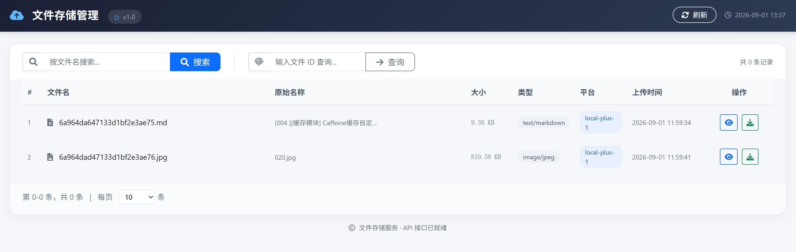

> 文件信息
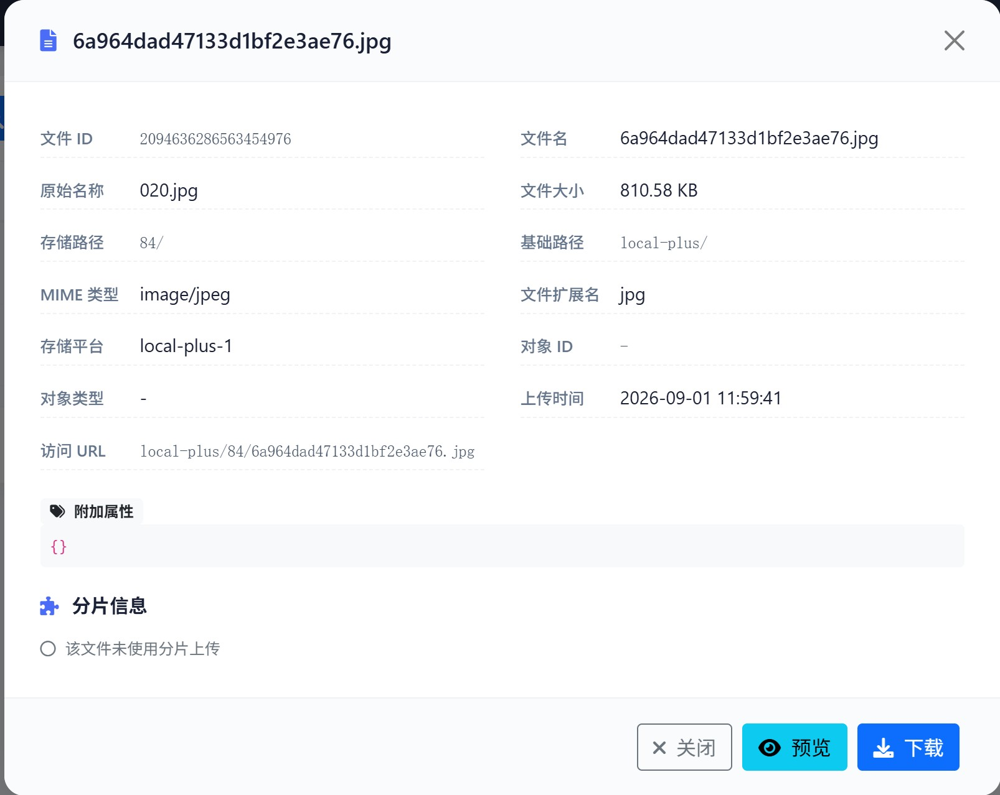


### ✨ oauth模块示例（framework/framework-examples/examples-oauth）

> API Key 限流示例
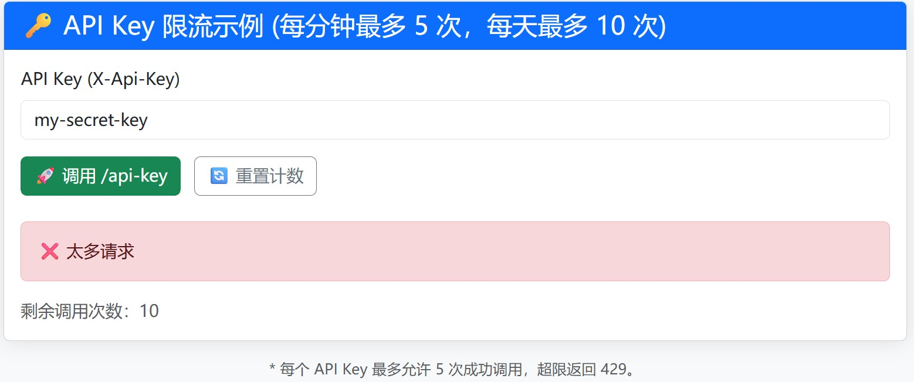

> Sa-Token集成示例
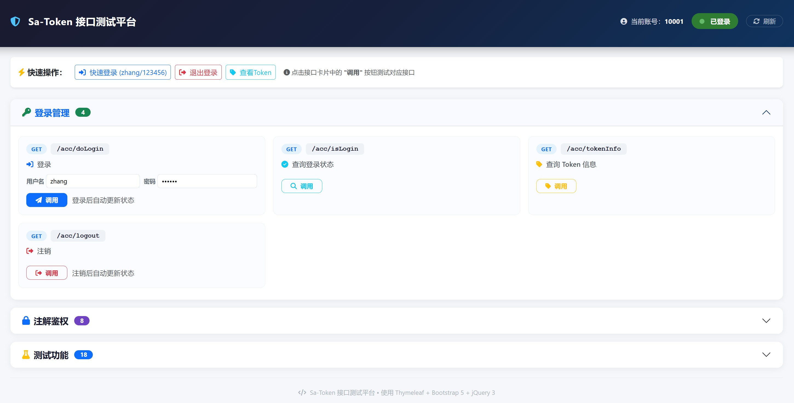

### 消息模块示例（framework/framework-examples/examples-message）

#### profile:nats,rabbit,kafka

> 短信发送
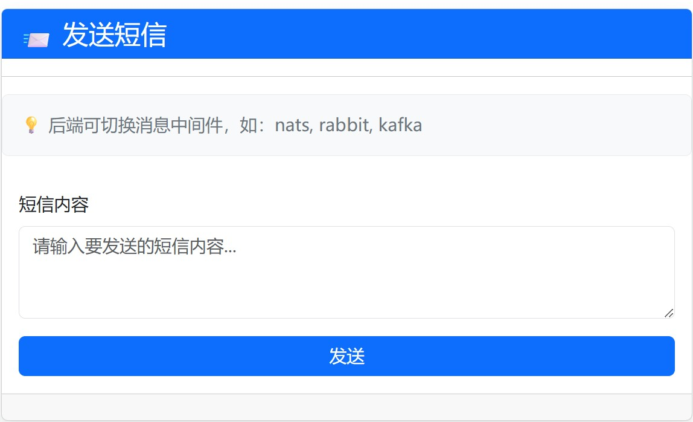

### ✨ OSS对象存储模块示例（framework/framework-examples/examples-oss）

#### profile:fss

> 上传文件，使用x-file-storage-spring框架
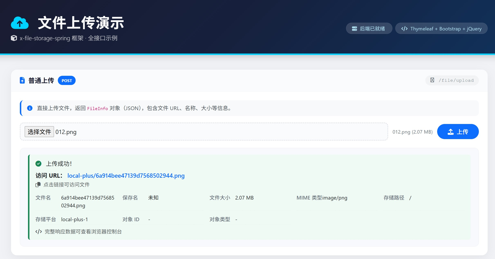

> 上传文件监控
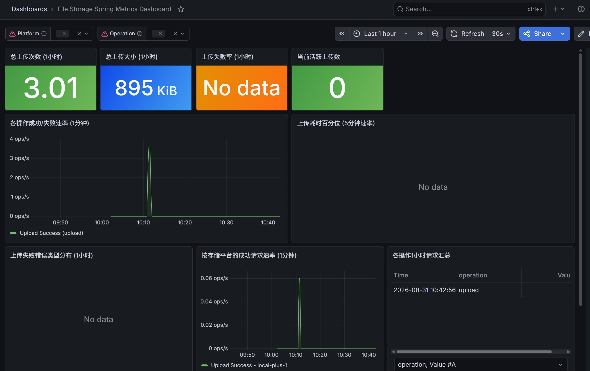


### 缓存模块示例（framework/framework-examples/examples-cache）

#### profile:cacheable

> @Cacheable 示例


#### profile:lock

> Redisson 锁示例


> Redis 锁示例


> 本地（JVM） 锁


> 幂等性演示
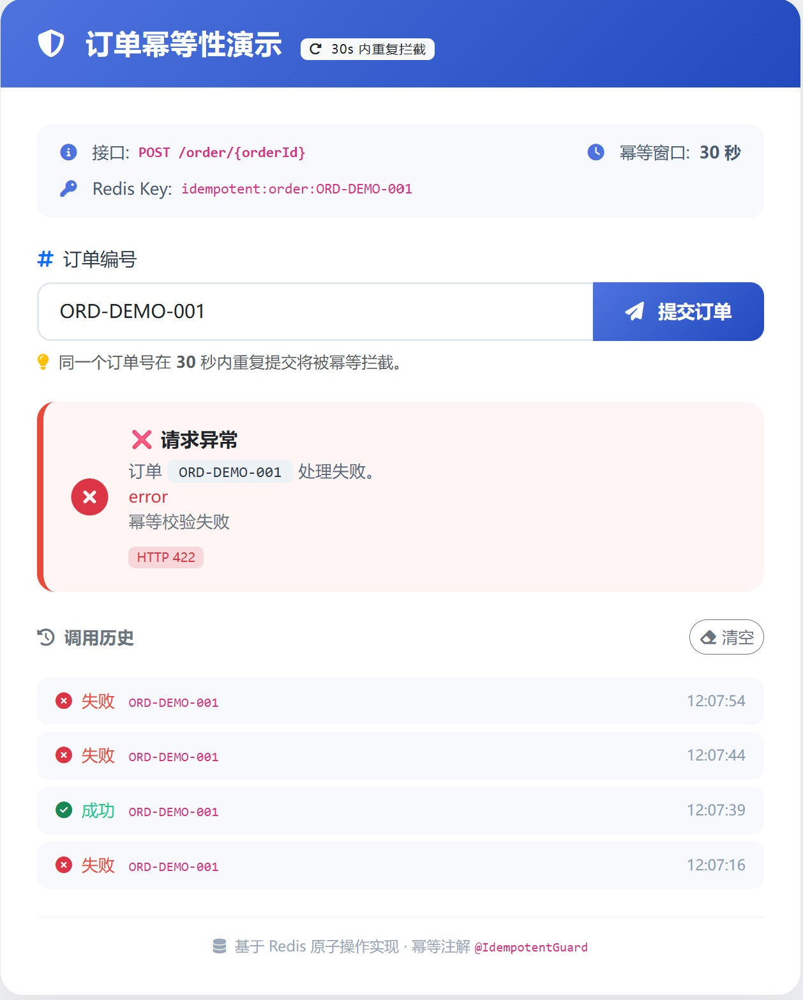

#### profile:template

> 缓存模版


#### profile:multi-level

> 本地（JVM） 锁


### 验证码模块示例（framework/framework-examples/examples-captcha）

#### profile:simple

> 验证码数据


#### profile:unified

> hutool验证码接口


> tianai验证码接口


#### profile:tianai

> tianai验证码官方标准接口


#### profile:interceptor

> 基于过滤器的验证码校验


### 加解密模块示例（framework/framework-examples/examples-crypto）

#### profile:simple

> 加密/解密 工具


> 摘要计算


#### profile:api

> api请求，响应加解密


### 数据模块示例（framework/framework-examples/examples-data）

#### profile:jpa

> 基于jpa的查询


#### profile:mybatis

> 基mybatis的curd


### 多租户模块示例（framework/framework-examples/examples-tenant）

#### profile:cache

> Spring Cache 多租户演示


#### profile:jpa-database

> 多租户用户管理系统(JPA+数据库隔离)


> 多租户用户管理系统(JPA+表隔离)


#### profile:mybatis-database

> 多租户用户管理系统(MYBATIS+表隔离)


> 多租户用户管理系统(MYBATIS+数据库隔离)


### 调度模块示例（framework/framework-examples/examples-schedule）

#### profile:xxl-job

> xxl-job 任务 示例


#### profile:powerjob

> powerjob 任务 示例


### web模块示例（framework/framework-examples/examples-web）

#### profile:annotation

> 接口防护 示例


#### profile:cached-body

> 请求体缓存演示


#### profile:client

> 三种HTTP客户端对比


#### profile:request-logging

> 请求日志 示例


#### profile:signature

> 签名支付示例 示例


#### profile:trace

> Trace API 测试控制台


#### profile:xss

> XSS 防护演示


#### profile:validation

> 校验异常演示


> 校验异常演示(响应式)


#### profile:totp

> 两步验证


> 博客发布(2fa)


### 消息模块示例（framework/framework-examples/examples-message）

#### profile:redis-list

> 基于Redis List的短信消息示例


> 基于 Redis ZSet 的延迟任务队列


## 博客文章

* [004-缓存模块-Caffeine缓存自定义：构建灵活的Spring Boot缓存管理器](docs/blog/004.md)                                                                                  
* [005-缓存模块-Redis自定义缓存：基于Spring Boot的精细化缓存管理实践](docs/blog/005.md)                                                                                
* [006-缓存模块-两级缓存实战：基于 Caffeine + Redis 的多级缓存设计与实现](docs/blog/006.md)
* [007-租户模块-基于 TransmittableThreadLocal 与 TaskDecorator 的租户上下文传递设计](docs/blog/007.md)
* [008-租户模块-基于Caffeine的租户隔离与两级缓存实践](docs/blog/008.md)
* [009-租户模块-基于 Hibernate 的多租户连接提供者设计实战](docs/blog/009.md)
* [010-数据模块-多数据源管理器在 Hibernate 多租户中的应用](docs/blog/010.md)
* [011-数据模块-基于雪花算法的 Hibernate 分布式主键生成器设计与实现](docs/blog/011.md)
* [012-缓存模块-基于 Spring Cache 的缓存操作模版，支持Caffeine缓存, Redis缓存及两级缓存](docs/blog/012.md)
* [013-缓存模块-基于Redis的计数器缓存模板设计——AbstractCounterCacheTemplate 技术解析](docs/blog/013.md)
* [014-web模块-构建可重复读取的请求体：Spring Boot 请求缓存过滤器设计与实现](docs/blog/014.md)
* [015-web模块-基于Spring Boot的HTTP客户端日志与默认配置实战](docs/blog/015.md)
* [016-web模块-基于 MDC 的分布式追踪框架设计与实现](docs/blog/016.md)
* [017-web模块-基于计数器的接口幂等性与访问限流设计实战](docs/blog/017.md)
* [018-web模块-基于AntiSamy的XSS攻击防护过滤器设计与实现](docs/blog/018.md)
* [019-数据模块-MyBatis-Plus 拦截器扩展设计：基于函数式接口与 Spring 自动装配](docs/blog/019.md)
* [020-缓存模块-基于 BeanCreator 的缓存管理器创建器模式设计与实践](docs/blog/020.md)
* [021-数据模块-基于 BaseEnum 的统一枚举处理方案：序列化与 JPA 转换实践](docs/blog/021.md)
* [022-数据模块-基于雪花算法的 MyBatis-Plus 主键生成器设计与实现](docs/blog/022.md)
* [023-数据模块-深入剖析 MyBatis 通用枚举处理器：BaseEnum 与 BaseEnumTypeHandler 的设计与实现](docs/blog/023.md)
* [024-Web模块-基于 AntiSamy 的 Spring Boot XSS 防护实践：从过滤器到反序列化的多层防御](docs/blog/024.md)
* [025-Web模块-基于 Spring Boot 的请求日志过滤器设计与实现](docs/blog/025.md)
* [026-数据模块-基于 MyBatis Plus 的企业级数据访问框架设计与实现](docs/blog/026.md)
* [027-Web模块-基于 Spring MVC 的 API 签名校验拦截器设计与实现](docs/blog/027.md)
* [028-缓存模块-命名缓存：多级个性化缓存配置的设计与实现](docs/blog/028.md)
* [029-公共模块-基于 Jakarta Validation 实现的自定义日期时间格式校验](docs/blog/029.md)
* [030-Web模块-Spring Boot 验证与 OpenAPI 集成实战：从校验规则到文档生成](docs/blog/030.md)
* [031-缓存模块-RedisTemplate工具的租户隔离设计：自动Key前缀机制](docs/blog/031.md)
* [032-缓存模块-基于Redis Bitmap的用户行为统计实战：签到与日活分析](docs/blog/032.md)
* [033-缓存模块-基于 Redisson 的租户隔离 Redis Key 前缀设计](docs/blog/033.md)
* [034-公共模块-基于SpEL的方法参数表达式求值器设计与实现](docs/blog/034.md)
* [035-缓存模块-Redisson 分布式锁实战：可重入锁与阻塞锁的设计与实现](docs/blog/035.md)
* [036-缓存模块-基于 Redis 自定义缓存锁的设计与实现](docs/blog/036.md)
* [037-缓存模块-基于 Guava Striped 的声明式本地锁设计与实现](docs/blog/037.md)
* [038-验证码模块-基于 Hutool 的 Spring Boot 验证码组件设计与实现](docs/blog/038.md)
* [039-验证码模块-天意验证码（Tianai Captcha）Spring Boot 自动配置深度解析](docs/blog/039.md)
* [040-验证码模块-验证码请求过滤器（CaptchaRequestFilter）设计与实现解析](docs/blog/040.md)  d                                                                               
* [041-公共模块-分布式唯一ID生成器设计与实现：一款灵活可扩展的雪花算法框架](docs/blog/041.md)
* [042-数据模块-Mybatis Plus 数据库级租户：基于多数据源路由的动态隔离实现](docs/blog/042.md)
* [043-数据模块-基于 Spring Data JPA 的企业级数据访问层设计——实体、审计、状态与服务抽象](docs/blog/043.md)
* [044-Web模块-基于 Google Authenticator 的 TOTP 双因素认证框架设计与实现](docs/blog/044.md)
* [045-Crypto模块-设计一个可扩展的加解密框架：策略模式与工厂模式实战](docs/blog/045.md)
* [046-Crypto模块-Spring Boot 自动配置进阶：按需装配加解密处理器](docs/blog/046.md)
* [047-Crypto模块-基于 Hutool 的常见加解密算法封装与密钥自动生成](docs/blog/047.md)
* [048-Crypto模块-Spring Boot 请求体自动解密：@Crypto 注解 + RequestBodyAdvice 实现](docs/blog/048.md)
* [049-Crypto模块-前后端混合加密API实战：基于Spring Boot的AES+RSA安全传输方案](docs/blog/049.md)
* [050-功能模块-基于 Redis Bitmap 的高性能签到系统设计](docs/blog/050-.md)
* [051-缓存模块-基于 StringRedisTemplate 的多租户 Key 隔离设计与实践——以 RedisBitmapUtils 为例](docs/blog/051.md)
* [052-核心模块-Java线程池封装实践：`ExecutorServiceHolder` 设计与实现](docs/blog/052.md)
* [053-核心模块-Java枚举缓存与ORM集成实践](docs/blog/053.md)
* [054-核心模块-工厂模式的“Bean工具化”设计：从静态工具到Spring托管Bean的演进](docs/blog/054.md)
* [055-调度模块-Spring动态任务调度框架的设计与实现](docs/blog/055.md)
* [056-调度模块-RunnableDecorator – 任务执行的增强装饰器](docs/blog/056.md)
* [057-调度模块-分布式环境下定时任务的防重复执行方案](docs/blog/057.md)
* [058-调度模块-任务生命周期事件与监听器机制](docs/blog/058.md)
* [059-调度模块-配置驱动的任务仓库 – 从 YAML 加载任务](docs/blog/059.md)
* [060-调度模块-Redisson vs Redis 原生锁：两种分布式锁实现深度对比](docs/blog/060.md)
* [061-调度模块-领域驱动的任务调度架构设计与分层实践](docs/blog/061.md)
* [062-调度模块-任务全生命周期管理 —— 从启动到追踪的完整闭环](docs/blog/062.md)
* [063-调度模块-事件驱动的日志记录与高效查询体系](docs/blog/063.md)
* [064-缓存模块-两级缓存实战：基于 Caffeine 和 Redis 的多级缓存设计与实现](docs/blog/064.md)
* [065-缓存模块-Hibernate二级缓存自定义实现：基于Spring Cache的多级缓存适配器](docs/blog/065.md)
* [066-调度模块-基于Spring Boot的分布式定时任务框架集成：PowerJob与XXL-JOB自动配置解析](docs/blog/066.md)
* [067-公共模块-构建优雅的Java异常处理框架：从错误码到统一响应](docs/blog/067.md)
* [068-公共模块-Spring Boot 全局异常处理与参数校验实战（上）：架构设计与响应封装](docs/blog/068.md)
* [069-公共模块-Spring Boot 全局异常处理与参数校验实战（下）：校验异常精细化处理与 WebFlux 适配](docs/blog/069.md)
* [070-Web模块-Spring MVC TOTP 二次认证拦截器：设计与源码深度解析](docs/blog/070.md)
* [071-验证码模块-基于Spring拦截器的验证码认证设计思想](docs/blog/071.md)
* [072-验证码模块-验证码认证拦截器实现解析与扩展实战](docs/blog/072.md)
* [073-示例-基于Redis分布式锁的定时任务调度实践](docs/blog/073.md)
* [074-示例-基于Redisson的分布式锁在定时任务中的实践与异常模拟](docs/blog/074.md)
* [075-示例-基于自定义的定时任务框架实战详解](docs/blog/075.md)
* [076-核心模块-构建优雅的Java异常处理框架：从错误码到全局异常处理](docs/blog/076.md)
* [077-消息模块-基于 Redis List 的轻量级消息队列框架设计解析](docs/blog/077.md)
* [078-消息模块-基于 Redis ZSet 的延迟消息队列设计与实现](docs/blog/078.md)
* [079-消息模块-基于 Redis Stream 的高可靠消息队列实现——Spring Data Redis 实战解析](docs/blog/079.md)  
* [080-缓存模块-Spring Cache缓存键前缀设计与租户隔离实践](docs/blog/080.md)
* [081-缓存模块-基于 Redis + AOP 的幂等性守卫设计与实现](docs/blog/081.md)
* [082-缓存模块-基于 Redis Lua 脚本实现分布式锁与原子操作实战](docs/blog/082.md)
* [083-消息模块-Spring Cloud Stream 多中间件适配实战——从代码结构看消息驱动设计](docs/blog/083.md)
* [084-消息模块-深入 Spring Cloud Stream 配置——Kafka、RabbitMQ、NATS 横向对比](docs/blog/084.md)
* [085-消息模块-从 SMS 示例看函数式消息编程与 StreamBridge 使用](docs/blog/085.md)
* [086-对象存储模块-基于Spring Boot的文件存储模块监控设计与实现](docs/blog/086.md)
* [087-对象存储模块-基于 x-file-storage 构建 Spring Boot 文件存储服务：从设计到实践](docs/blog/087.md)
* [088-OAuth模块-认证核心框架架构解析：oauth-core 的自动装配、配置模型与拦截器注册](docs/blog/088.md)
* [089-OAuth模块-API Key 双窗口限流深度解析：Redis Lua 原子计数与请求拦截链路](docs/blog/089.md)
* [090-OAuth模块-API Key 限流开箱即用：examples-oauth 接入实战与效果演示](docs/blog/090.md)