# tutorials4j

Java 教程

## 项目列表

| 组件            | 作用              |
|---------------|-----------------|
| `framework`   | 基于Spring Boot的框架 |
| `assembly`    | 基于`framework`框架的集成模块 |
| `java21`      | Java21示例项目      |
| `springboot3` | Spring Boot3的示例项目 |
| `springboot4` | Spring Boot4的示例项目 |
| `springcloud` | Spring Cloud的示例项目 |

## 公众号

如果对我的项目代码感兴趣，请关注我的公众号，有很多文章等着你

## 示例图

### 功能模块示例（framework/framework-examples/examples-feature）

> 签到示例
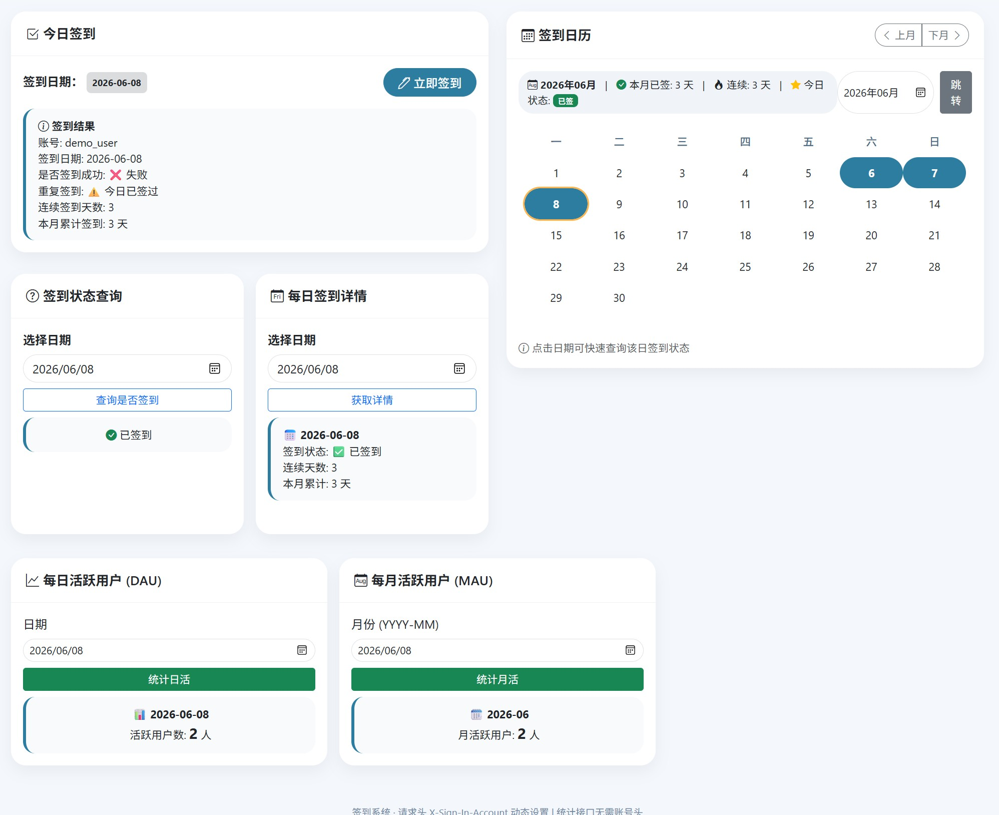

> 签到记录查询示例

### 缓存模块示例（framework/framework-examples/examples-cache）

#### profile:cacheable

> @Cacheable 示例
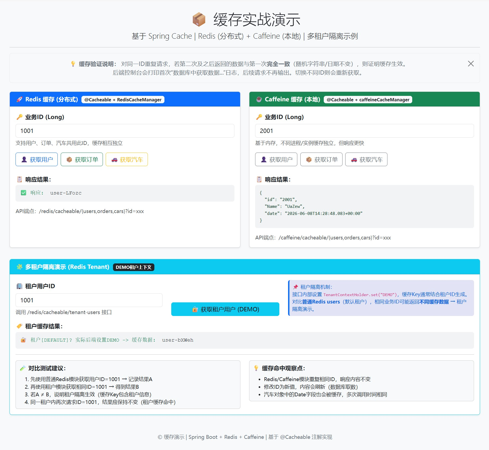

#### profile:lock

> Redisson 锁示例
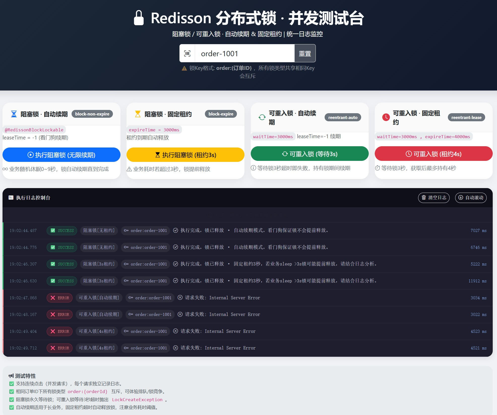

> Redis 锁示例
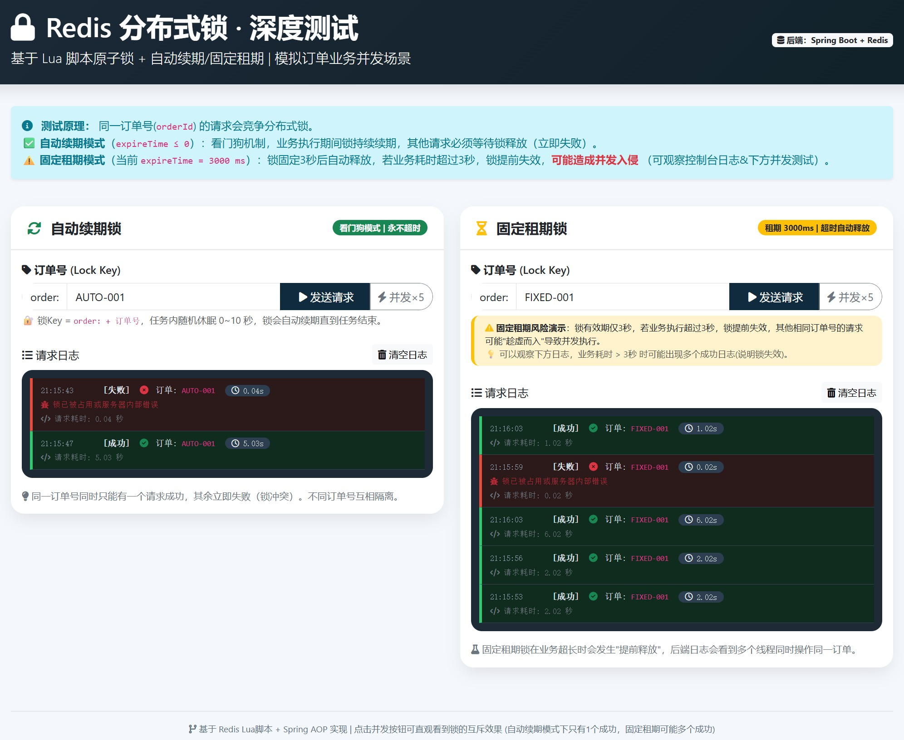

> 本地（JVM） 锁
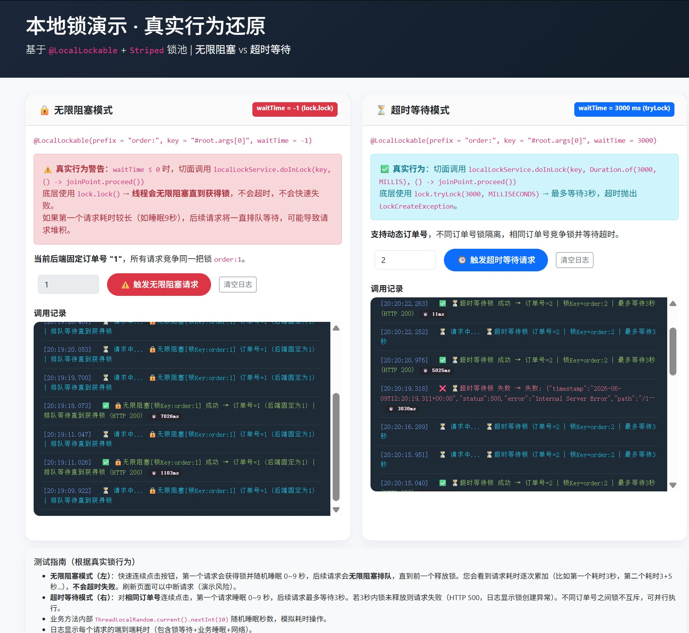

#### profile:template

> 缓存模版

#### profile:multi-level

> 缓存模版

### 验证码模块示例（framework/framework-examples/examples-captcha）

#### profile:captchaendpoint

> hutool验证码接口
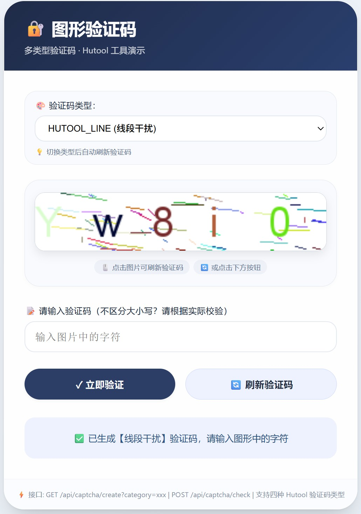

> tianai验证码接口

#### profile:tianaicaptchaendpoint

> tianai验证码官方标准接口
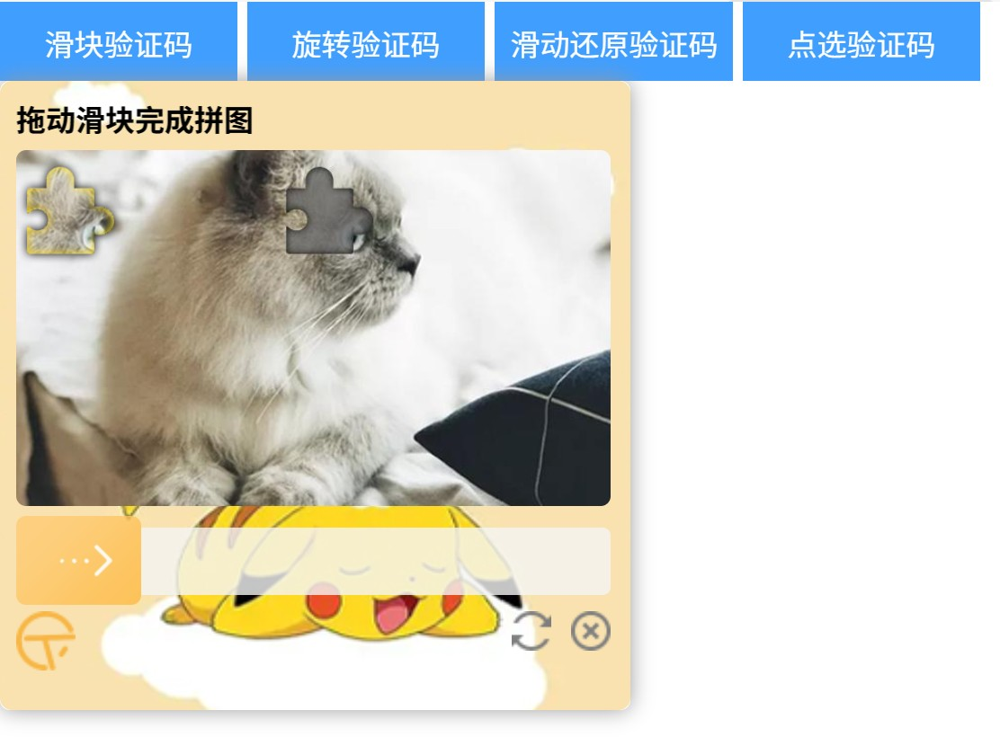
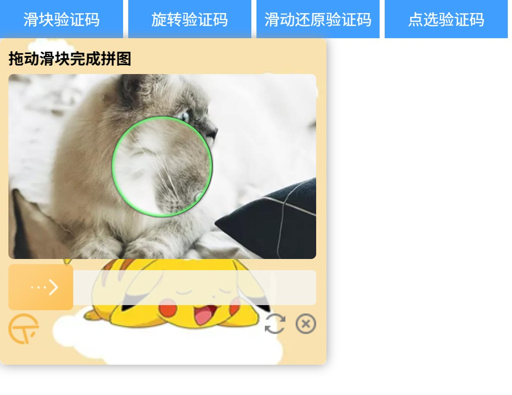

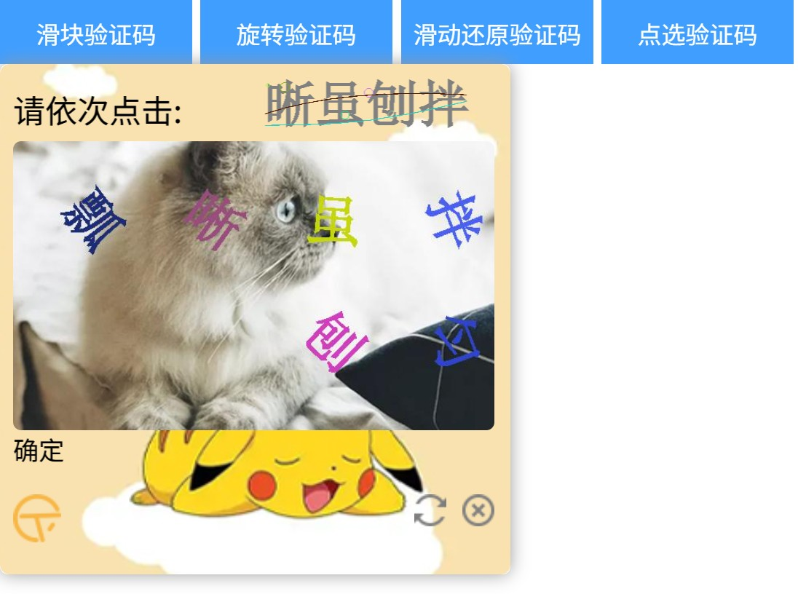

#### profile:tianaicaptchaendpoint

> 基于过滤器的验证码校验

### 加解密模块示例（framework/framework-examples/examples-crypto）

#### profile:api

> api请求，响应加解密
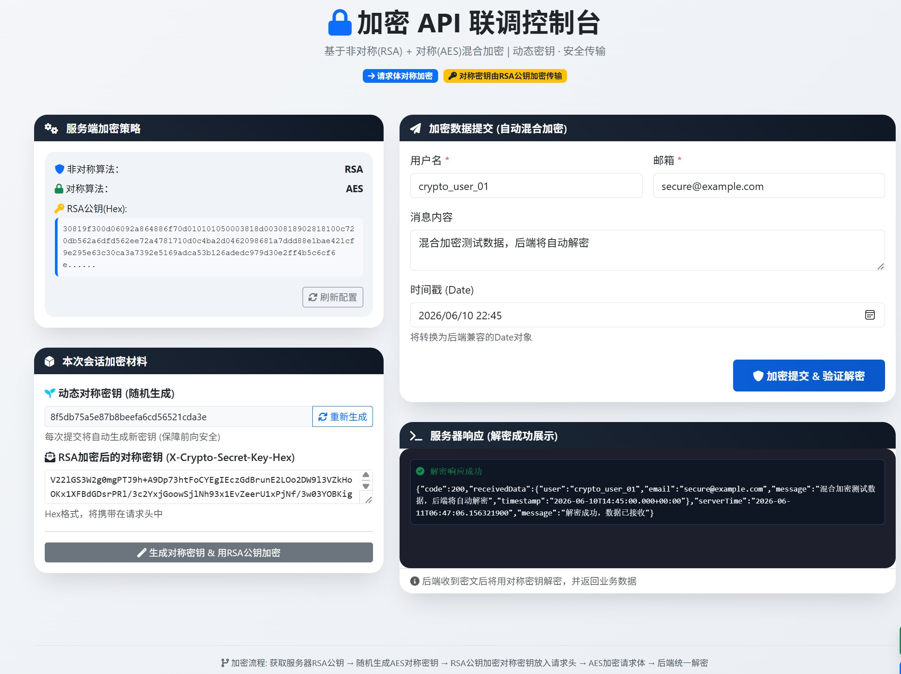

### 数据模块示例（framework/framework-examples/examples-data）

#### profile:jpa

> 基于jpa的查询
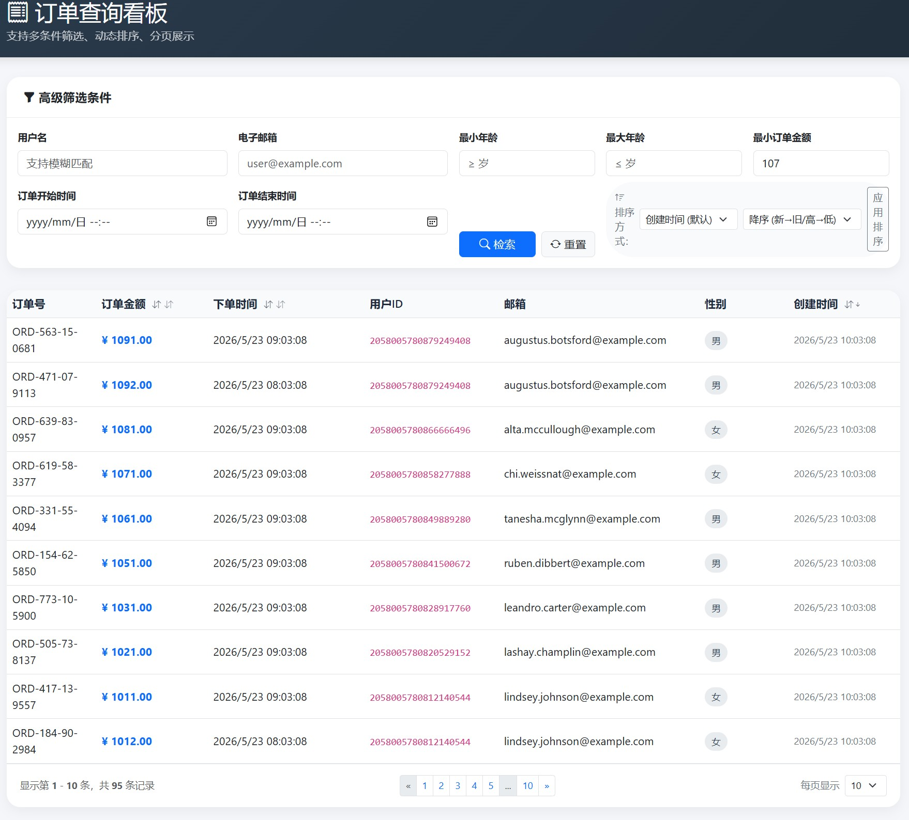

#### profile:mybatis

> 基mybatis的curd

### 多租户模块示例（framework/framework-examples/examples-tenant）

#### profile:cache

> Spring Cache 多租户演示

#### profile:jpa-database

> 多租户用户管理系统(JPA+数据库隔离)

> 多租户用户管理系统(JPA+表隔离)

