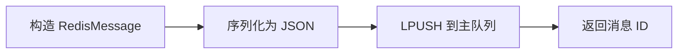
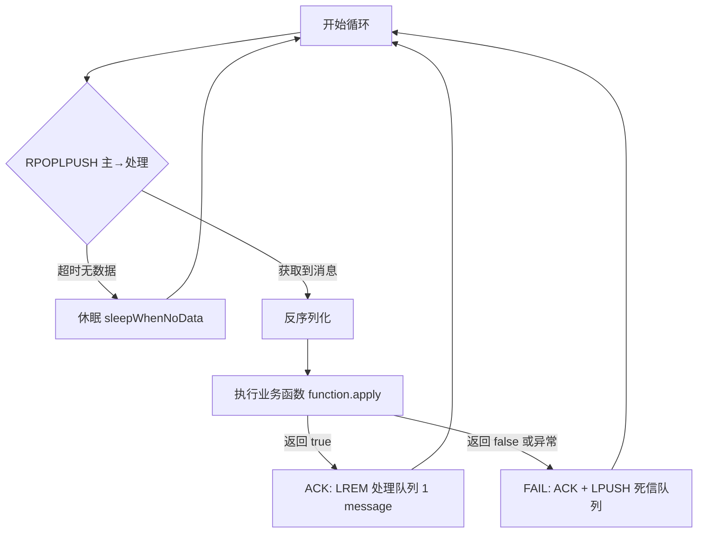

# [077][消息模块]基于 Redis List 的轻量级消息队列框架设计解析

本文章代码: https://gitee.com/yunjiao-source/tutorials4j

## 引言

消息队列是分布式系统中解耦、异步、削峰的核心组件。对于大多数互联网应用，引入 RabbitMQ、Kafka 等重型中间件有时显得“杀鸡用牛刀”，尤其是在流量可控、运维成本敏感的场景下。Redis 凭借其高性能、丰富的数据结构和广泛的使用基础，常被用来实现轻量级队列。

本文介绍一套基于 Redis List 实现的可靠消息队列框架（来自 `tutorials4j.framework.message.redis`），它提供了主队列、处理队列、死信队列三层结构，支持消息重试、可靠性确认和灵活的消费模式。我们将从架构设计、核心组件、工作流程、使用示例、优劣分析等方面深度解析，帮助你快速理解并应用这套框架。

---

## 一、整体架构与设计思想

### 1.1 三层队列模型

框架为每个业务队列设计了三条 Redis List：

- **主队列（Main Queue）**：`{queueName}`，存放待处理消息。
- **处理队列（Processing Queue）**：`{queueName}:processing`，存放正在被消费但尚未确认的消息。
- **死信队列（Dead Letter Queue）**：`{queueName}:dead_letter`，存放处理失败或超过重试次数的消息。

这种设计借鉴了消息中间件中“unacked”队列的经典做法，通过原子操作实现消息的可靠性传递。

### 1.2 可靠性保证

- **原子转移**：消费时使用 `RPOPLPUSH`（或 `rightPopAndLeftPush`）将消息从主队列原子地移动到处理队列，避免消息丢失。
- **显式确认（ACK）**：消费成功后需调用 `ack` 将消息从处理队列删除；失败则调用 `fail`，将消息移入死信队列。
- **异常保护**：消费过程中抛出异常时，框架会自动捕获并执行失败处理，确保消息不会丢失。

### 1.3 重试与死信机制

- 每条消息包含 `retryCount` 字段，用于记录已重试次数。
- 死信消费者可从死信队列拉取消息，根据 `retryCount` 判断是否继续重试（如 `< 3` 则重新发送到主队列，否则放弃并记录）。
- 重试时通过 `cloneAndIncreaseRetryCount()` 生成新消息，保留 `parentId` 以追踪原始消息链。

### 1.4 线程模型

- 每个队列对应一个 `ListMessageTemplate` 实例，负责该队列的所有操作。
- 消费逻辑由用户自行启动线程（或线程池），框架仅提供循环消费方法 `consumerMain` / `consumerDeadLetter`，用户传入业务处理函数。
- 模板本身是线程安全的，但建议每个队列由少量线程消费，避免争抢 Redis 连接。

---

## 二、核心组件详解

### 2.1 RedisMessage 消息记录

```java
@JsonTypeInfo(use = JsonTypeInfo.Id.CLASS)
@Builder
public record RedisMessage(
    String id,
    String parentId,
    Instant timestamp,
    String queueName,
    int retryCount,
    Map<String, String> data) { ... }
```

- 使用 `record` 类型，不可变，便于传递。
- `@JsonTypeInfo` 保证反序列化时的类型安全（需配合 `ObjectMapper` 的多态配置）。
- `cloneAndIncreaseRetryCount()` 创建重试消息，继承父 ID，更新时间戳，增加重试计数。

### 2.2 ListMessageFactory 工厂

```java
public class ListMessageFactory {
    public static final ListMessageFactory instance = new ListMessageFactory();
    // 持有 RedisTemplate、ObjectMapper、配置 Map
    private final Map<String, ListMessageTemplate> templateMap = new ConcurrentHashMap<>();
    public ListMessageTemplate template(String queueName) { ... }
}
```

- 采用**单例模式**，全局唯一工厂。
- 根据 `queueName` 延迟创建 `ListMessageTemplate`，并缓存。
- 创建时检查配置，若未找到对应队列选项则抛出异常。
- `@PreDestroy` 时关闭所有模板，释放资源。

### 2.3 ListMessageTemplate 核心模板

每个模板实例持有一个队列的三条 Redis Key 以及配置参数（阻塞超时、休眠时间等）。主要方法：

| 方法 | 说明 |
|------|------|
| `send(Map<String,String> data)` | 构造默认消息并推入主队列 |
| `send(RedisMessage message)` | 直接发送已构建的消息 |
| `consumerMain(Function<RedisMessage, Boolean> function)` | 主队列消费循环，接收函数返回布尔值表示成功/失败 |
| `consumerDeadLetter(Consumer<RedisMessage> consumer)` | 死信队列消费循环，处理死信 |
| `getQueueStats()` | 返回三条队列的长度，用于监控 |
| `shutdown()` | 停止消费循环（通过 `AtomicBoolean running` 控制） |

### 2.4 配置属性

`RedisMessageProperties` 支持按队列配置以下参数（通过 `ListQueueOptions`）：

- `blockTimeout`：`BLPOP` / `RPOPLPUSH` 的阻塞超时时间（默认 5 秒）。
- `sleepWhenNoData`：队列为空时循环等待的休眠时长（默认 1 秒）。
- `sleepWhenException`：发生异常后重试前的休眠时长（默认 1 秒）。

---

## 三、工作流程深度解析

### 3.1 消息发送流程



### 3.2 主队列消费流程（核心）



- `RPOPLPUSH` 是原子操作，保证了消息不会在转移过程中丢失。
- ACK 使用 `LREM` 精确删除消息，因为处理队列中可能有多条相同内容（但 ID 唯一，所以安全）。
- FAIL 时先 ACK 再推入死信，确保原消息从处理队列移除。

### 3.3 死信消费流程

死信消费者通过 `RPOP` 从死信队列获取消息，然后业务逻辑决定如何处理（如重发）。示例中 `SmsConsumerDeadLetter` 检查重试次数，若小于 3 则调用 `cloneAndIncreaseRetryCount()` 并重新 `send`，否则记录错误并丢弃（或可另做持久化）。

---

## 四、实战示例：短信服务

以短信发送服务为例，展示框架的完整使用。

### 4.1 配置

在 `application.yml` 中配置（示例）：

```yaml
tutorials4j:
  message:
    redis:
      list-queues:
        sms:
          block-timeout: 5s
          sleep-when-no-data: 1s
          sleep-when-exception: 1s
```

### 4.2 生产者

```java
@Service
public class SmsService {
    private final ListMessageTemplate smsTemplate;
    public SmsService(ListMessageFactory factory) {
        this.smsTemplate = factory.template("sms");
    }
    public void sendSms() {
        Map<String, String> data = Map.of("phone", "13800138000", "content", "Hello");
        smsTemplate.send(data);
    }
}
```

### 4.3 消费者实现

- **主消费者**：实现 `Function<RedisMessage, Boolean>`，模拟随机失败。
- **死信消费者**：实现 `Consumer<RedisMessage>`，重试逻辑。

启动时通过 `CommandLineRunner` 初始化两个消费线程（注意示例中启动了两次主消费者，可并行消费）。

### 4.4 启动与测试

通过 Controller 调用生产接口，观察日志输出，消息会被正常消费或进入死信并重试。

---

## 五、优缺点与适用场景

### ✅ 优点

- **轻量**：无需额外中间件，仅依赖 Redis，适合微服务或小型项目。
- **可靠性**：通过原子操作和确认机制，保证消息不丢失（Redis 持久化配置需同步）。
- **灵活**：消费逻辑完全由用户控制，可自由扩展重试策略、监控等。
- **低侵入**：框架封装良好，使用简单。

### ❌ 缺点

- **单点瓶颈**：Redis 单实例或主从模式下，性能受限于 Redis 节点，不适合海量消息。
- **无分布式支持**：不支持分区、负载均衡（多个消费节点需自行协调）。
- **消息顺序**：List 是 FIFO，但多消费者并发时顺序无法保证。
- **监控较弱**：仅提供队列长度，缺乏消费积压、延迟等详细指标。
- **内存风险**：若消费速度跟不上，主队列积压可能撑爆 Redis 内存。

### 🎯 适用场景

- 内部系统间异步通信，对吞吐量要求不高（< 10k TPS）。
- 需要可靠投递但不想引入重型 MQ 的“轻量级”场景。
- 已有 Redis 基础设施，希望复用。

---

## 六、潜在改进与优化方向

1. **使用 Lua 脚本增强原子性**：当前的 `fail` 是两次操作（ACK + LPUSH），虽然非原子，但理论上若第二步失败，消息会停留在处理队列（需人工介入）。可考虑用 Lua 包装。
2. **支持批量消费**：使用 `RPOPLPUSH` 批量版本（如 `LMOVE` 多参数）提高吞吐。
3. **增加消费进度管理**：记录每个消费者的处理状态，便于故障恢复。
4. **延迟消息支持**：可结合 Redis Sorted Set 实现延迟投递。
5. **完善监控**：接入 Micrometer 暴露队列大小、消费耗时、失败率等指标。
6. **支持消费者组**：实现类似 Redis Streams 的消费者组功能（但会大幅增加复杂度）。

---

## 七、总结

本文深入剖析了一套基于 Redis List 的轻量级消息队列框架的设计与实现。它通过三层队列和原子操作，提供了可靠的消息传递能力，同时支持重试和死信处理。代码结构清晰，易于定制，非常适合作为学习或快速落地的消息中间件方案。

当然，它并非万能的，生产环境需结合自身流量、可用性要求综合评估。希望这篇解析能为你在消息队列选型和设计上提供有价值的参考。

