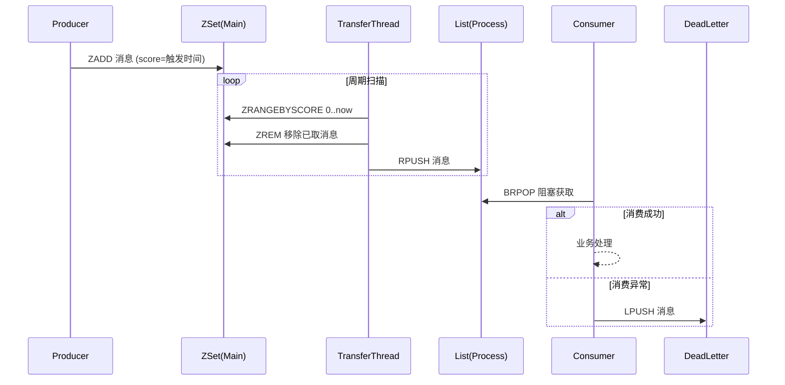

# [078][消息模块]基于 Redis ZSet 的延迟消息队列设计与实现

本文章代码: https://gitee.com/yunjiao-source/tutorials4j

## 一、背景与选型

在分布式系统中，延迟任务（如订单超时关闭、定时提醒、重试补偿等）是常见需求。传统方案依赖数据库轮询或 Quartz 等定时任务，存在性能瓶颈和调度延迟。Redis 凭借高性能、数据结构丰富等特性，成为实现轻量级延迟队列的热门选择。

本项目采用 **Redis ZSet（有序集合）** 作为延迟队列的底层存储，结合 **List（列表）** 作为就绪队列，通过 Lua 脚本保证原子性，构建了一套高可用、易扩展的延迟消息队列框架。其核心设计思想如下：

- **延迟存储**：ZSet 的 `score` 存储消息的触发时间戳，利用 `ZRANGEBYSCORE` 按时间顺序获取到期消息。
- **就绪转移**：独立线程周期性扫描 ZSet，将到期消息原子性地转移到 List，供消费者拉取。
- **死信处理**：消费失败的消息进入独立死信 List，支持重试或人工干预。

## 二、数据结构与流程

### 2.1 队列命名规范

每个业务队列（由 `queueName` 标识）对应三个 Redis Key：

| Key 名称 | 数据类型 | 用途 |
|---------|---------|------|
| `mainQueueName` | ZSet | 存储延迟消息，score = 触发时间戳，member = 序列化的消息 JSON |
| `processQueueName` | List | 存储已到期的待处理消息（左侧入队，右侧出队） |
| `deadLetterQueueName` | List | 存储消费失败的消息（死信） |

### 2.2 核心交互流程



### 2.3 消息模型

- **`BaseRedisMessage`**：基础消息字段（ID、时间戳、队列名、重试次数、业务数据）。
- **`DelayRedisMessage`**：包装基础消息和延迟时间（`Duration`）。

序列化采用 Jackson，消息体为 JSON 字符串，便于跨语言兼容。

## 三、原子性转移：Lua 脚本

转移到期消息是延迟队列的关键操作，必须保证 **原子性**，避免在查询和删除之间发生并发竞争。项目中通过 Lua 脚本 `SCRIPT_TRANSFER` 实现：

```lua
local messages = redis.call('ZRANGEBYSCORE', KEYS[1], 0, ARGV[1])
if #messages > 0 then
    redis.call('ZREM', KEYS[1], unpack(messages))
    redis.call('RPUSH', KEYS[2], unpack(messages))
end
return #messages
```

- **KEYS[1]**：主队列（ZSet），**KEYS[2]**：处理队列（List）。
- **ARGV[1]**：当前时间戳（`System.currentTimeMillis()`）。
- 执行过程：读取所有 score ≤ 当前时间的消息 → 从 ZSet 移除 → 全部推入 List，一气呵成，无并发干扰。

该脚本返回成功转移的消息数量，用于日志监控。

## 四、线程模型与消费机制

### 4.1 后台转移线程

在 `ZSetMessageTemplate` 构造时，自动启动一个名为 `zset-message-transfer` 的后台线程，循环执行 `transferExpiredMessages()`。该线程持续运行，直到调用 `shutdown()` 终止。当扫描到无到期消息时，通过 `sleepForWait` 短暂休眠（默认配置），避免空转消耗 CPU。

### 4.2 消费者线程

框架不强制消费模式，而是提供 `consumerProcess(Consumer<DelayRedisMessage>)` 和 `consumerDeadLetter(Consumer<DelayRedisMessage>)` 方法，由业务方自行创建线程（或使用线程池）驱动消费。示例中通过 `TaskHandler` 和 `TaskExceptionHandler` 实现 `Runnable` 并启动两个消费线程。

- **阻塞获取**：使用 `rightPop(key, timeout, unit)`，设置 `blockTimeout`，当队列为空时阻塞等待，减少无效轮询。
- **异常处理**：消费过程中若抛出异常，消息会被 `fail()` 方法推入死信队列，并记录日志。同时捕获异常后短暂休眠，防止连接异常时的快速重试风暴。

### 4.3 死信重试机制

`TaskExceptionHandler` 作为死信消费者，从死信队列中取出消息，判断重试次数（`retryCount`）是否达到上限（3次），若未达到则调用 `cloneAndIncreaseRetryCount()` 增加重试计数，并重新调用 `addTask()` 投递，实现延迟重试。若达到上限则直接丢弃（可扩展为持久化告警）。

## 五、工厂模式与配置管理

`ZSetMessageFactory` 采用单例模式，集中管理所有队列的 `ZSetMessageTemplate` 实例。它依赖于 `queueOptionsMap`（从配置文件注入），每个队列可独立配置：

- **`sleepWhenException`**：发生异常时的休眠时间（默认 5 秒）。
- **`blockTimeout`**：消费者阻塞超时时间（默认 5 秒）。

通过 `template(String queueName)` 方法按需创建并缓存模板，避免重复创建线程和 Redis 连接。

在 Spring Boot 环境中，工厂的 `@PreDestroy` 方法会在容器关闭时遍历所有模板并调用 `shutdown()`，确保后台线程优雅终止。

## 六、使用示例（Spring Boot 集成）

### 6.1 配置队列参数

```yaml
message:
  redis:
    queue-options:
      task1:
        sleep-when-exception: 3s
        block-timeout: 10s
```

### 6.2 注册工厂 Bean

```java
@Configuration
public class MessageConfig {
    @Bean
    public ZSetMessageFactory zSetMessageFactory(
            RedisTemplate<String, String> redisTemplate,
            JacksonRecord jacksonRecord,
            @Value("${message.redis.queue-options}") Map<String, QueueOptions> options) {
        ZSetMessageFactory factory = ZSetMessageFactory.instance;
        factory.setStringRedisTemplate(redisTemplate);
        factory.setJacksonRecord(jacksonRecord);
        factory.setQueueOptionsMap(options);
        return factory;
    }
}
```

### 6.3 生产者

```java
@Service
public class TaskService {
    private final ZSetMessageTemplate template;

    public TaskService(ZSetMessageFactory factory) {
        this.template = factory.template("task1");
    }

    public void addTask() {
        Map<String, String> data = Map.of("orderId", "12345");
        template.addTask(data, Duration.ofSeconds(30));
    }
}
```

### 6.4 消费者

```java
@Component
public class TaskHandler implements Runnable, Consumer<DelayRedisMessage> {
    private final ZSetMessageTemplate template;

    @Override
    public void run() {
        template.consumerProcess(this);
    }

    @Override
    public void accept(DelayRedisMessage msg) {
        // 业务逻辑
        System.out.println("Processing: " + msg);
    }
}
```

启动时通过 `CommandLineRunner` 启动多个消费者线程。

## 七、可靠性保障与调优建议

### 7.1 原子性
Lua 脚本保证“查询-删除-入队”的原子性，避免消息丢失或重复转移。

### 7.2 死信隔离
失败消息进入独立队列，不影响正常消费，且提供重试机会。

### 7.3 阻塞超时
合理设置 `blockTimeout` 可平衡响应性与资源消耗，建议根据业务容忍度调整（例如 5~30 秒）。

### 7.4 异常休眠
当 Redis 连接异常或消费异常时，短暂休眠（如 3~5 秒）可避免高频重试拖垮系统。

### 7.5 消费并发
可根据消息量启动多个消费者线程（示例中启动 2 个），但注意确保业务逻辑幂等，防止重复消费（框架暂未提供 ack 机制，消费成功后消息即从 List 移除，因此需业务自身保证幂等）。

### 7.6 监控与告警
可扩展 `fail` 方法，将死信消息持久化到数据库或发送告警，便于人工介入。

## 八、总结

该延迟消息队列框架基于 Redis 原生数据结构，以极小的代码量实现了延迟投递、可靠消费、死信重试等核心能力，适合中小规模场景（消息量百万级以内）。其设计简洁、扩展灵活，通过调整配置参数即可适应不同业务需求。

**后续优化方向**：
- 支持消息确认（ACK）机制，由消费者显式确认后删除，避免自动删除带来的丢失风险。
- 增加消息持久化备份，防止 Redis 重启导致未消费消息丢失。
- 支持延迟精度调整（如毫秒级）。

Redis ZSet 延迟队列是分布式任务调度的轻量级方案，理解其设计原理有助于开发者根据自身场景做出合理的技术决策。

---

**附：项目源码结构简图**

```
tutorials4j.framework.message.redis
├── bean          // 消息实体类
├── factory       // ZSetMessageFactory
├── template      // ZSetMessageTemplate（核心）
├── properties    // 配置属性类
└── examples      // 示例代码（生产者、消费者、重试）
```