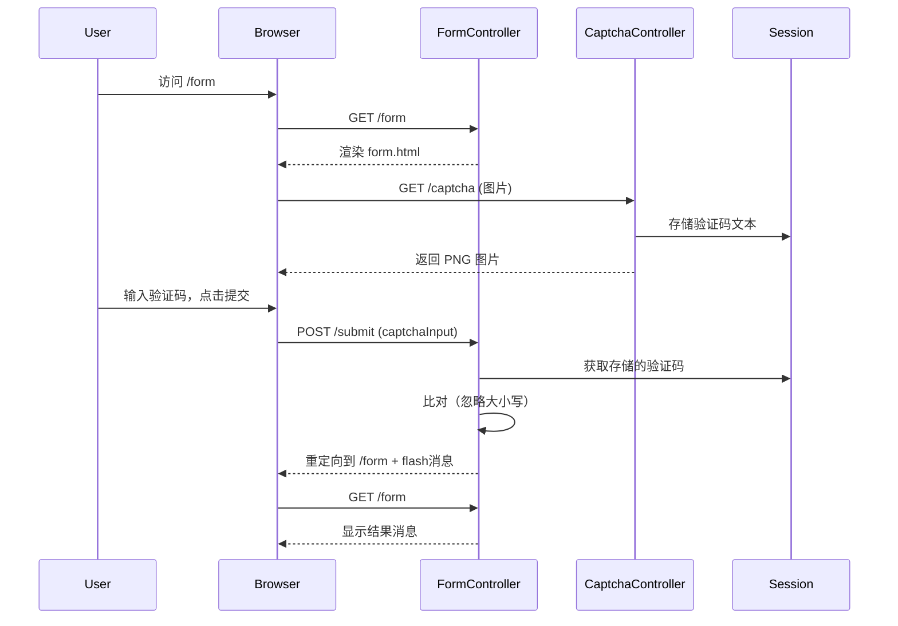

# springboot3-captcha-simple

## 代码功能概述

这是一个基于 **Spring Boot 3** 的简单验证码示例项目，主要实现以下功能：

1. **生成验证码图片** (`/captcha`)：生成随机的 5 位字母验证码，绘制成带噪点、干扰线和随机旋转的 PNG 图片，并将验证码文本存入 `HttpSession`。
2. **展示表单页面** (`/form`)：通过 Thymeleaf 渲染 `form.html`，其中包含验证码输入框、图片显示及“换一张”链接。
3. **提交校验** (`/submit`)：接收用户输入的验证码，与 session 中保存的文本（忽略大小写）比对，根据结果显示成功/失败消息，并重定向回表单页。

---

## 各文件详细分析

### 1. `CaptchaController.java`
```java
@GetMapping("/captcha")
public void getCaptcha(HttpSession session, HttpServletResponse response) throws IOException
```
- **职责**：生成验证码并输出图片。
- **流程**：
  - 调用 `CaptchaUtil.createVerificationImage()` 获取 `Pair<验证码文本, BufferedImage>`。
  - 将文本存入 session，key 为 `"captcha"`。
  - 设置响应头禁止缓存，内容类型为 `image/png`。
  - 通过 `ImageIO.write()` 将图片写入响应输出流。
- **评价**：简洁清晰，符合预期。但直接写入 `response.getOutputStream()` 后无需手动关闭流（容器负责）。

### 2. `CaptchaUtil.java`
核心工具类，提供验证码图片生成逻辑。

#### `createVerificationImage()`
- 使用 `RandomStringUtils.secure().nextAlphabetic(5)` 生成 5 位随机字母（仅大小写字母，不含数字）。
- 创建 `BufferedImage`，类型 `TYPE_INT_ARGB`（支持透明背景，但实际未利用）。
- 绘制黑色文字：每个字符间隔 16px，起始 x=10，y=32，字体 `SansSerif, Bold, 24`。
- 调用 `applyArtisticEffects(image)` 添加噪点、干扰线并旋转。
- 返回 `Pair.of(code, image)`。

#### `rotateImage()`
- 随机角度 `(-20° ~ 20°)`，围绕图片中心旋转。
- 新建 `BufferedImage` 并绘制旋转后的图像。

#### `applyArtisticEffects()`
- **添加噪点**：循环 30 次，随机位置设置随机 RGB 颜色。
- **添加干扰线**：5 条随机起点和终点的直线，颜色随机。
- 最后调用 `rotateImage()` 返回最终图片。

#### `getRandomRgb()`
- 生成 `(R,G,B)` 各 0~255 的随机整数，打包成 int 格式。

**潜在问题与改进建议**：

| 问题 | 说明 | 建议 |
|------|------|------|
| **随机数安全性** | 使用 `java.util.Random` 生成噪点、旋转角度、线条位置等，但验证码对安全性要求不高时可接受。若需防暴力识别，建议改用 `SecureRandom`。 | 可统一使用 `SecureRandom` 或保持现状（示例性质）。 |
| **文本可读性差** | 干扰线和噪点较多，且旋转随机，可能导致验证码难以被人类识别。 | 减少噪点数量（如 15 个）、线条数量（2~3 条），或降低旋转幅度（±10°）。 |
| **文本仅含字母** | 缺少数字，且未排除易混淆字符（如 `O`、`I`、`l`）。 | 可改为 `RandomStringUtils.secure().nextAlphanumeric(5)` 并过滤掉 `0,1,O,I,l` 等。 |
| **图片尺寸固定** | 宽 100、高 40，字体 24，字符间距 16，最后一个字符可能贴边（`10 + 4*16 = 74`，留白不足）。 | 动态计算宽度：`width = 10 + code.length() * 16 + 10`。 |
| **颜色对比度低** | 文字固定黑色，背景透明（实际显示为白色或容器背景），但噪点和线条颜色随机，可能接近黑色导致文字难以辨认。 | 限制噪点和线条的亮度范围（例如 RGB 各 < 128 或 > 128），与文字形成对比。 |
| **性能** | 每次请求都创建 `BufferedImage` 和 `Graphics2D`，且旋转操作开销较大。但对于低并发场景可接受。 | 无特殊优化必要。 |
| **线程安全** | `CaptchaUtil` 无状态，所有方法静态，线程安全。但 `Random` 实例未使用 `ThreadLocal`，多线程下会有竞争（不过影响很小）。 | 可将 `Random` 改为 `ThreadLocalRandom` 或类级别 `SecureRandom`。 |

### 3. `FormController.java`
```java
@PostMapping("/submit")
public String handleSubmit(@RequestParam("captchaInput") String captchaInput, HttpSession session, RedirectAttributes redirectAttributes)
```
- 从 session 获取存储的验证码文本，与用户输入忽略大小写比较。
- 若成功：添加 flash 消息 `"验证码正确，提交成功！"`，并从 session 移除验证码（防止重用）。
- 若失败：添加 flash 错误消息。
- 重定向到 `/form`。

**潜在问题**：
- **验证码可重复使用**：虽然成功后会移除，但失败时不移除，且用户刷新验证码图片后 session 中会覆盖为新值，可能导致逻辑混乱。例如：
  - 用户打开页面，获取验证码 A。
  - 点击“换一张”获取验证码 B（session 更新为 B）。
  - 但用户可能仍尝试输入 A，此时 session 中已是 B，校验失败。
  - 建议：每次生成图片时都覆盖 session，这是当前行为，没问题。但“换一张”通过时间戳刷新图片，会调用 `/captcha` 并更新 session，用户应输入最新验证码。符合预期。
- **成功时立即移除**：防止同一个验证码被多次提交（重放攻击）。但若用户提交成功后退回表单再次提交，需要重新获取验证码，这是合理的安全设计。
- **失败时未移除**：允许用户在同一验证码下多次尝试，可能被暴力穷举（虽然 5 位字母组合很多，但无次数限制）。可增加尝试次数限制或验证码失效机制（如每次校验失败也刷新 session 中的验证码）。

### 4. `SpringBoot3CaptchaSimpleApplication.java`
标准 Spring Boot 启动类，无特殊配置。

### 5. `form.html` (Thymeleaf)
- 显示消息（成功/失败）。
- 表单 `POST /submit`，包含 `captchaInput` 输入框和验证码图片 ``。
- 提供“看不清？换一张”链接，调用 JavaScript `refreshCaptcha()` 为图片 URL 添加时间戳，强制浏览器重新加载（从而调用 `/captcha` 生成新验证码）。

**优点**：简单直观，用户体验较好。

**可改进点**：
- 无前端输入校验（如非空、长度），但后端已有 `required` 属性（仅 HTML5 校验，可被绕过）。后端应增加非空判断。
- 无 CSRF 保护（示例项目可忽略，生产环境建议启用 Spring Security 的 CSRF Token）。

---

## 整体工作流程



---

## 总结与改进建议汇总

### 优点
- 代码结构清晰，职责分离合理。
- 使用了 `HttpSession` 存储验证码，简单有效。
- 验证码图片加入了基本的防自动化识别措施（噪点、干扰线、旋转）。
- 使用 `RedirectAttributes` 的 flash 属性实现 POST-REDIRECT-GET 模式，避免重复提交。

### 主要缺点及改进方向

| 类别 | 问题 | 建议修复 |
|------|------|----------|
| **可读性** | 噪点过多、线条杂乱、旋转角度过大 | 减少噪点至 15 个、线条 2 条、旋转 ±10°；或改为可配置参数 |
| **安全性** | 无失败尝试限制，可能被暴力枚举 | 增加 session 中失败计数，超过 3 次强制刷新验证码或锁定一段时间 |
| **字符集** | 仅字母，未排除易混淆字符 | 使用 `nextAlphanumeric` 并过滤 `0,1,O,I,l` |
| **随机数** | 使用 `java.util.Random`（非加密安全） | 对于验证码这种低风险场景可接受，如需更高安全改用 `SecureRandom` |
| **内存/性能** | 每次请求创建新 `BufferedImage`，无缓存 | 示例项目无需优化，高并发时可考虑缓存常见背景等 |
| **错误处理** | 未处理 `ImageIO.write` 可能抛出的 `IOException` | 已在 `getCaptcha` 方法签名中声明抛出，由 Spring 统一处理即可 |
| **后端校验** | 未校验 `captchaInput` 是否为空 | 增加 `if (captchaInput == null || captchaInput.isBlank())` 并返回错误 |
| **Session 管理** | 验证码未设置有效期 | 可记录生成时间，校验时检查是否超时（如 5 分钟） |

### 可选的增强功能
- 支持数字+字母混合，并可配置长度。
- 使用 `@SessionAttributes` 或自定义组件来抽象验证码生成与校验逻辑。
- 添加日志记录验证码生成与校验结果（便于调试）。
- 提供 REST API 方式（返回 base64 图片或 token）。

整体而言，这是一个功能完整、可用于学习和快速集成的验证码示例，稍加调整即可用于生产环境。

