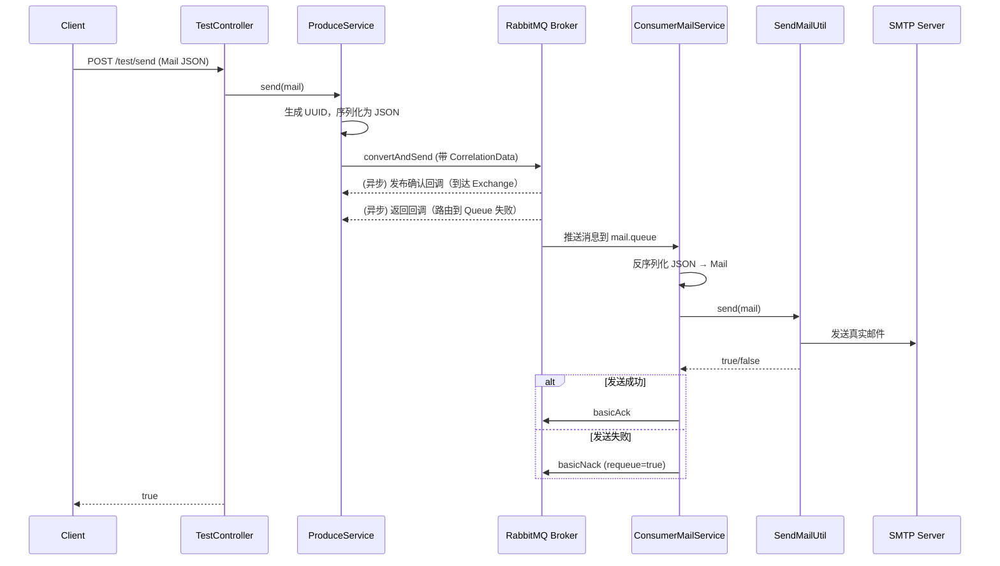

该代码实现了一个基于 **Spring Boot + RabbitMQ + JavaMailSender** 的异步邮件发送系统。整体架构分为消息生产、消息队列、消息消费和邮件发送四个环节，并实现了消息的可靠性投递和消费确认机制。

---

## 一、核心组件及功能

### 1. `Mail` 实体类
- 定义邮件信息的数据结构，包含：
    - `to`：收件人地址
    - `title`：邮件主题
    - `content`：邮件正文
    - `msgId`：消息唯一标识（由生产者生成 UUID）

### 2. `RabbitConfig` 配置类
- 声明 RabbitMQ 的核心组件：
    - **队列**：`mail.queue`（持久化）
    - **交换机**：`mail.exchange`（Direct 类型，持久化，非自动删除）
    - **绑定**：队列通过路由键 `mail.routing.key` 绑定到交换机
- 提供静态常量供生产者和消费者使用。

### 3. `ProduceService` 生产者服务
- 功能：将邮件消息发送到 RabbitMQ。
- 流程：
    1. 为每条消息生成 UUID 作为 `msgId`，设置到 `Mail` 对象中。
    2. 使用 `ObjectMapper` 将 `Mail` 对象序列化为 JSON 字符串。
    3. 调用 `RabbitTemplate.convertAndSend()`，指定交换机、路由键、消息体和 `CorrelationData`（携带 `msgId`）。
- 返回值：固定返回 `true`（仅表示发送动作已执行，不保证真正送达）。

### 4. `ConsumerMailService` 消费者服务
- 使用 `@RabbitListener` 监听 `mail.queue` 队列。
- 消费逻辑：
    1. 将消息体（JSON 字节数组）反序列化为 `Mail` 对象。
    2. 获取消息的 `deliveryTag`（用于确认/拒绝）。
    3. 调用 `SendMailUtil.send(mail)` 发送真实邮件。
    4. **成功** → 调用 `channel.basicAck(tag, false)` 确认消息已被消费。
    5. **失败** → 调用 `channel.basicNack(tag, false, true)` 拒绝消息并重新入队（requeue=true），以便稍后重试。

### 5. `SendMailUtil` 邮件发送工具类
- 使用 Spring 的 `JavaMailSender` 发送简单文本邮件。
- 从配置文件中读取 `spring.mail.from` 作为发件人。
- 发送成功返回 `true`，捕获 `MailException` 异常后返回 `false` 并记录日志。

### 6. `MyRabbitTemplateCustomizer` 自定义增强
- 实现 `RabbitTemplateCustomizer` 接口，对 `RabbitTemplate` 进行全局配置：
    - **发布确认（ConfirmCallback）**：监听消息是否成功到达交换机（Exchange）。
        - `ack=true`：消息到达交换机 → 日志记录成功。
        - `ack=false`：消息未到达交换机 → 记录失败原因和 `correlationData`。
    - **返回回调（ReturnsCallback）**：监听消息是否从交换机成功路由到队列。
        - 前提：`setMandatory(true)`，否则路由失败时消息会被直接丢弃。
        - 仅当路由失败（如队列不存在、绑定错误）时触发，记录交换器、路由键、回复码等信息。

### 7. `TestController` 测试控制器
- 提供 REST 接口 `POST /test/send`，接收 JSON 格式的 `Mail` 对象。
- 调用 `ProduceService.send(mail)` 将邮件请求发送到 RabbitMQ，立即返回 `true`。

---

## 二、整体消息流程

---

## 三、关键设计及可靠性保障

| 环节               | 机制                                                                 | 作用                                                         |
| ------------------ | -------------------------------------------------------------------- | ------------------------------------------------------------ |
| 消息发送到 Exchange | `ConfirmCallback`（发布确认）                                        | 确保生产者知道消息是否被 Exchange 接收，未接收时可记录日志或重发 |
| 消息路由到 Queue   | `ReturnsCallback` + `mandatory=true`                                 | 确保消息不会因路由失败而丢失，提供失败回调供生产者处理       |
| 消息消费           | 手动 ACK（`basicAck` / `basicNack`）                                 | 只有邮件真正发送成功后才确认消息；失败则重新入队，避免消息丢失 |
| 消息持久化         | 队列、交换机均设为 durable=`true`，消息体为 JSON 字符串（默认持久化） | 防止 Broker 重启后消息丢失                                   |
| 幂等性保障（部分） | 通过 `msgId` 可追溯每条消息，但业务层未实现重复消费去重               | 如需严格幂等，可结合数据库唯一键或 Redis 实现                |

---

## 四、潜在问题与改进建议

1. **生产者无失败重试**
    - 当前 `ProduceService.send()` 直接返回 `true`，未处理发布确认或返回回调中的失败场景。
    - **建议**：使用 `CorrelationData` 的 `Future` 或 `CompletableFuture` 同步/异步确认结果，失败时抛出异常或保存到数据库待重发。

2. **消费者重试无限循环**
    - 邮件发送失败会调用 `basicNack(requeue=true)`，消息重新回到队列头部，可能无限重试（如收件地址错误）。
    - **建议**：增加重试次数限制或死信队列（DLX），达到最大重试次数后路由到 `mail.dlq`。

3. **并发消费问题**
    - 默认 `@RabbitListener` 并发度为 1，如需提高吞吐量可配置 `concurrency`。
    - **注意**：邮件发送是 I/O 密集型，合理增加并发消费者数量。

4. **无监控与告警**
    - 仅记录日志，缺少 Metrics 或健康检查（如发送失败次数、队列堆积数量）。
    - **建议**：集成 Micrometer 暴露 RabbitMQ 指标，配置 Prometheus + Grafana。

5. **邮件内容简单**
    - 仅支持纯文本（`SimpleMailMessage`），不支持附件、HTML 模板。
    - **可扩展**：使用 `MimeMessageHelper` 支持富文本和附件。

---

## 五、总结

该系统是一个典型的 **异步消息驱动的邮件发送服务**，利用 RabbitMQ 解耦邮件发送请求与实际处理，并通过发布确认、返回回调、手动 ACK 等机制提升了消息的可靠性。代码结构清晰，职责分离，适合作为中小型应用中异步通知（如注册激活、告警邮件）的基础组件。