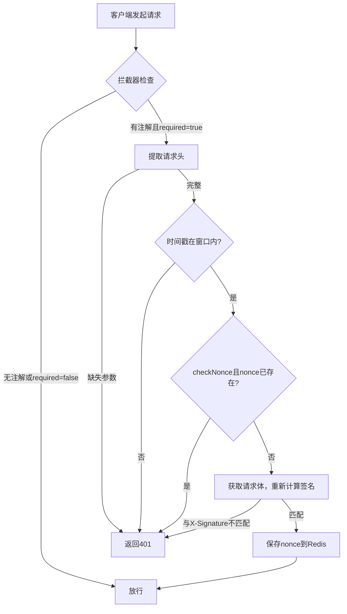

# springboot3-rest-signature

## 功能分析

该项目实现了一个基于 **HMAC-SHA256** 的 REST API 签名验证机制，用于保护 Spring Boot 3 应用中的接口，防止请求被篡改、重放攻击等。核心功能包括：

### 1. 签名验证流程
- **注解驱动**：通过 `@RequireSignature` 注解标记需要验签的方法（如 `DemoController.pay`）。
- **拦截器验证**：`SignatureInterceptor` 对所有 `/signature/**` 路径进行拦截，检查方法是否带有 `@RequireSignature` 注解，若需要则执行签名校验。

### 2. 请求头要求
客户端必须在 HTTP 请求头中提供以下四个参数：

| Header         | 说明                                 |
|----------------|--------------------------------------|
| `X-App-Key`    | 应用标识，用于查找对应的 `appSecret`   |
| `X-Timestamp`  | 请求时间戳（毫秒）                     |
| `X-Nonce`      | 一次性随机字符串，防重放                |
| `X-Signature`  | 客户端计算出的签名值                   |

### 3. 签名生成与验证（`SignatureUtils`）
- **签名串构造**：将 `appKey`、`timestamp`、`nonce`、`method`、`path`、`body`（非空时）放入 `TreeMap` 自动排序，拼接为 `key=value&...` 格式。
- **签名算法**：使用 `HMAC-SHA256`，密钥为 `appSecret`，对签名串计算哈希并转为十六进制字符串。
- **验证**：服务端按相同规则重新计算签名，与客户端传来的 `X-Signature` 比较是否一致。

### 4. 安全校验（`SignatureInterceptor`）
- **完整性检查**：四个请求头均不能为空。
- **时间窗口校验**：`|当前时间 - X-Timestamp|` 不得超过 `@RequireSignature.timeWindow` 秒（默认 300 秒），防止过期请求。
- **防重放（Nonce）**：若 `checkNonce=true`（默认开启），会检查 Redis 中是否已存在该 nonce。若存在则拒绝；若通过则将该 nonce 存入 Redis，TTL 等于 `timeWindow` 秒。
- **签名验证**：调用 `SignatureUtils.verify` 确认签名有效性。

### 5. 异常与响应
- 任何验证失败抛出 `SignatureException`，拦截器捕获后返回 HTTP 401，响应体为 `{"code":401,"message":"错误原因"}`。

### 6. 密钥管理（`AppKeyCache`）
- 目前为内存 `ConcurrentHashMap` 硬编码示例（`your_app_key` → `your_app_secret`）。
- 设计上支持多版本密钥并存，适合对接配置中心实现动态刷新。

### 7. 依赖组件
- **Redis**：`NonceService` 使用 `RedisTemplate` 存储 nonce，需要 Redis 环境。
- **Apache Commons**：`IOUtils`（读 body）、`StringUtils`、`codec`（Hex 编码）。
- **Lombok**：简化构造器和日志。

### 8. 使用示例
- 无需签名的接口：`POST /signature/create`
- 需要签名的接口：`POST /signature/pay`（带 `@RequireSignature` 注解）

---

## 工作流程图（简要）

## 优点与潜在改进点

**优点**：
- 标准 HMAC 签名，防篡改。
- 时间窗口 + nonce 双重防重放。
- 注解灵活控制，对业务代码侵入小。

**潜在改进**：
- `getRequestBody` 会读取流，可能导致 `ServletRequest` 的 body 后续无法再读取（需配合 `ContentCachingRequestWrapper` 或类似方案）。
- `AppKeyCache` 硬编码，生产环境应接入配置中心或数据库。
- 异常返回格式固定为 JSON，但未设置 HTTP 状态码为 401（实际只设置了响应体内容，可补充 `response.setStatus(401)`）。
- 签名串中未包含请求的 query 参数，若接口使用 URL 参数应一并纳入签名。

