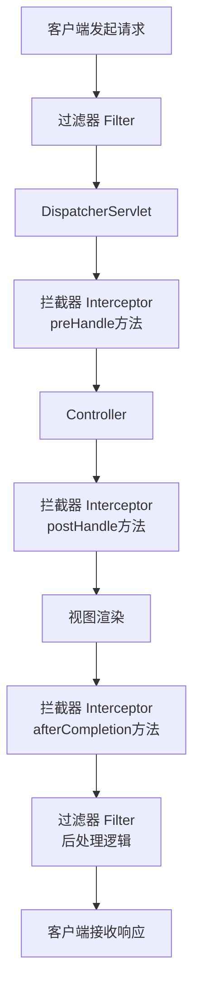

# springboot3-rest-signature

## HandlerInterceptor 与 FilterRegistrationBean 执行顺序

`Filter`（通过 `FilterRegistrationBean` 注册）的执行优先级**高于** `HandlerInterceptor`，它在请求处理链的更前端工作，执行的先后顺序是固定的：

**Filter > HandlerInterceptor**

两者的详细执行顺序和原理可以分解为以下几个步骤：

### ⚙️ 核心执行顺序
当一个请求到来时，它的完整旅程是：`请求` → `Filter链` → `DispatcherServlet` → `HandlerInterceptor链` → `Controller`，处理完成后则按原路逆向返回。

### 🔧 原理与顺序控制
Filter 和 Interceptor 优先级不同的根本原因，在于它们属于不同的规范层级。

| 特性 | `Filter` (通过 `FilterRegistrationBean` 注册) | `HandlerInterceptor` |
| :--- | :--- | :--- |
| **所属规范** | Servlet 规范 | Spring MVC 框架 |
| **执行顺序** | 在 `DispatcherServlet` **之前**执行，优先级更高 | 在 `DispatcherServlet` **之后**、`Controller` **之前**执行 |
| **顺序控制** | 通过 `FilterRegistrationBean` 的 `setOrder()` 方法，数字越小越先执行 | 通过 `InterceptorRegistry` 的 `addInterceptor()` 方法的添加顺序 |

简单来说，`Filter` 的优先级更高，是因为它基于 Servlet 规范，工作在更底层；而 `HandlerInterceptor` 基于 Spring 框架，能接触到更具体的业务上下文，控制粒度更细。

### 💎 总结
当请求通过 `Filter` 时，它会执行 `doFilter()` 方法中的逻辑。如果一切正常，它会调用 `chain.doFilter()` 将请求传递给下一个 `Filter`，最终传给 `DispatcherServlet`，从而进入 `HandlerInterceptor` 的处理流程。