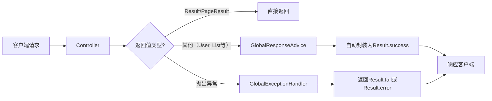

# rest-response

## 功能分析

该项目实现了一套 **Spring Boot 3** 下统一的 REST API 响应封装与异常处理机制。核心目标：让 Controller 层代码更简洁，返回数据格式统一，异常处理自动化。下面从组件、流程、使用场景三个方面进行分析。

---

### 一、核心组件说明

| 组件 | 类型 | 作用 |
|------|------|------|
| `Result<T>` | 响应封装类 | 统一返回结构：`{code, message, data}`，提供静态工厂方法（success/fail/error） |
| `ResultCode` | 枚举 | 预定义常用状态码（200, 400, 401, 500, 600...）及默认消息 |
| `PageResult<T>` | 分页响应类 | 继承 `Result<List<T>>`，扩展分页字段（total, totalPage, currentPage, pageSize） |
| `GlobalResponseAdvice` | 响应拦截器 | 自动将非 `Result`/`PageResult` 的返回值封装为 `Result.success(data)` |
| `GlobalExceptionHandler` | 全局异常处理器 | 捕获各类异常（业务、参数校验、404、通用异常），返回标准 `Result` 格式 |
| `BusinessException` | 自定义业务异常 | 可携带自定义状态码，由全局处理器统一处理 |
| `DemoController` | 示例控制器 | 演示 7 种典型场景（成功/失败/异常/分页）的用法 |

---

### 二、工作流程

#### 1. 正常响应（无异常）
- **void / 普通对象 / List**：被 `GlobalResponseAdvice` 拦截 → 自动包装为 `Result.success(data)`
- **直接返回 `Result` 或 `PageResult`**：不被拦截，原样返回（用于分页或自定义失败场景）

#### 2. 异常响应
- **业务异常** (`BusinessException`)：处理器捕获 → 根据异常中的 code 或默认 `BUSINESS_ERROR` 返回 `Result.fail`
- **参数校验异常** (`MethodArgumentNotValidException`)：提取第一条错误信息 → 返回 `Result.fail(BAD_REQUEST, msg)`
- **404 异常** (`NoHandlerFoundException`)：返回 `Result.fail(NOT_FOUND)`
- **其他未预期异常**：兜底处理，返回 `Result.error("服务器内部异常...")`，避免暴露敏感信息

---

### 三、关键设计亮点

#### 1. 零侵入的自动封装
- 利用 `ResponseBodyAdvice` 接口，无需在 Controller 中手动调用 `Result.success()`，普通返回类型自动包装。
- 通过 `supports` 方法排除 `Result` 和 `PageResult`，避免重复封装。

#### 2. 灵活的分页支持
- 分页场景通常需要额外字段（total, totalPage 等），若自动包装为 `Result` 会丢失这些字段。
- 解决方案：提供 `PageResult` 子类，由开发者手动返回，该类型不会被拦截。

#### 3. 层次分明的异常处理
- 自定义业务异常：可携带状态码，与 `ResultCode` 对齐。
- 参数校验异常：提取友好的字段校验信息。
- 兜底异常：区分开发/生产环境（注释中提示可调整返回内容）。

#### 4. 状态码枚举集中管理
- `ResultCode` 集中定义状态码和默认消息，避免魔法数字，便于维护。

---

### 四、使用示例（来自 DemoController）

| 场景 | 方式 | 说明 |
|------|------|------|
| 成功（无数据） | `public void successEmpty()` | 自动封装为 `{code:200, message:"操作成功", data:null}` |
| 成功（单对象） | `public User successSingle()` | 自动封装为 `Result<User>` |
| 成功（列表） | `public List<User> successList()` | 自动封装为 `Result<List<User>>` |
| 分页 | `public PageResult<User> successPage()` | 手动返回 `PageResult`，不被拦截，保留分页字段 |
| 手动失败 | `public Result<?> failParam()` | 直接返回 `Result.fail`，不被拦截，自定义错误信息 |
| 业务异常 | `public User failBusiness()` | 抛出 `BusinessException` → 全局处理器封装为 `Result.fail` |
| 系统异常 | `public User errorSystem()` | 抛出空指针异常 → 兜底处理器返回 `Result.error` |

---

### 五、注意事项与可扩展点

1. **PageResult 必须手动返回**：因为分页字段无法通过自动封装补全。
2. **静态工厂方法命名**：`Result.success(data)`、`Result.fail(code, msg)` 等，语义清晰。
3. **异常日志**：全局处理器使用 `@Slf4j` 记录异常栈，便于排查问题。
4. **404 处理前提**：需要在 `application.properties` 中开启 `spring.mvc.throw-exception-if-no-handler-found=true` 并关闭静态资源映射，否则 `NoHandlerFoundException` 不会触发。
5. **校验注解支持**：若 Controller 参数使用 `@Valid` 和 `@NotNull` 等，校验失败会自动进入 `MethodArgumentNotValidException` 分支。

---

### 六、总结

该设计实现了一套 **通用、简洁、可扩展** 的 REST 响应规范：
- **统一格式**：所有接口返回结构一致，便于前端统一处理。
- **减少重复代码**：自动封装 + 全局异常处理，Controller 只需关注业务逻辑。
- **分页友好**：保留专用分页对象，不与普通响应混淆。
- **异常分级**：区分业务异常、参数异常、系统异常，分别返回恰当的状态码和提示。

适用于中大型 Spring Boot 项目，可作为基础组件直接集成。

